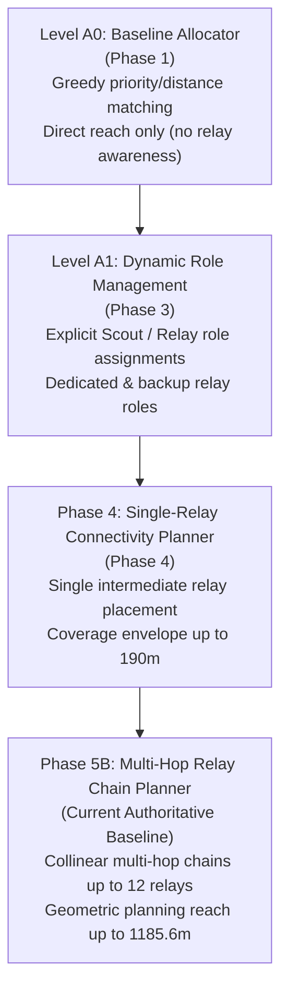
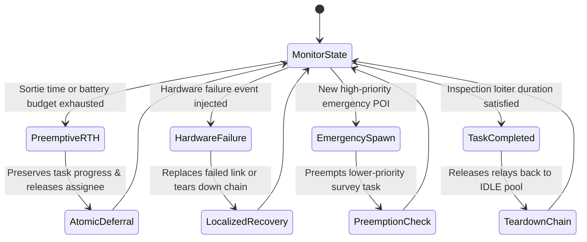

# Autonomy & Task Planning Architecture

## 1. Overview & Autonomy Hierarchy

AetherSwarm implements a tiered, deterministic autonomy hierarchy for multi-UAV disaster-response operations. The framework coordinates heterogeneous tasks—including primary point-of-interest (POI) reconnaissance, emergency target inspections, and multi-hop communication relaying—under strict radio frequency (RF) cutoffs, energy boundaries, and airspace separation rules.

The planning subsystem has evolved through structured development phases:

---

## 2. Level A0: Baseline Greedy Allocator

The [`A0TaskAllocator`](file:///home/dell/swarm_ws/AetherSwarm/src/ares_swarm/autonomy/task_allocator.py) provides the foundational, non-relayed assignment benchmark. It executes deterministic single-task, single-robot (ST-SR) matching.

### 2.1 Multi-Factor Utility Scoring
For each feasible UAV $i$ and unserviced task $j$, the utility score is computed as:

$$\text{Utility}(i, j) = w_P \cdot P_j - w_T \cdot C_{\text{travel}}(i, j) - w_E \cdot R_{\text{energy}}(i) - w_S \cdot C_{\text{switch}}(i, j)$$

Where:
- $P_j$: Task priority weight ($P_j \ge 1.0$). Default weight: $w_P = 1.0$.
- $C_{\text{travel}}(i, j) = \|\mathbf{p}_i - \mathbf{p}_j\|_2$: Euclidean distance in meters from UAV to POI. Default weight: $w_T = 0.001$.
- $R_{\text{energy}}(i) = \frac{100.0 - \text{battery\_pct}_i}{100.0} \in [0.0, 1.0]$: State of charge depletion penalty. Default weight: $w_E = 0.1$.
- $C_{\text{switch}}(i, j)$: Task switching penalty ($1.0$ if UAV is reassigned from another active task, $0.0$ otherwise). Default weight: $w_S = 1.0$.

### 2.2 Deterministic Tie-Breaking
To eliminate floating-point precision jitter across operating systems and compilers:
1. **Task Sorting**: Tasks are evaluated in order of priority descending (`-priority`), emergency flag descending (`is_emergency=True` first), and task identifier ascending (`task.id` lexicographical sort).
2. **Candidate Ranking**: Candidate utility scores are rounded to 8 decimal places (`round(score, 8)`). Ties between UAVs with identical scores are broken by ascending string order of `uav.id`.
3. **Greedy Matching**: The highest-ranked feasible UAV is assigned to the task and immediately removed from the available pool.

---

## 3. Level A1: Destination-Aware Allocation & Dynamic Roles

Phase 3 introduced [`A1DestinationAwareAllocator`](file:///home/dell/swarm_ws/AetherSwarm/src/ares_swarm/autonomy/a1_allocator.py) and explicit dynamic UAV role states in [`UAVRole`](file:///home/dell/swarm_ws/AetherSwarm/src/ares_swarm/core/enums.py):

| Role Name | Operational Behavior | Airspace Behavior | Reallocation Rule |
| :--- | :--- | :--- | :--- |
| `UAVRole.SCOUT` | Surveyor assigned to navigate to POI, loiter, and gather reconnaissance data. | Flies to POI coordinate; maintains target hover during inspection. | Eligible for reassignment upon task completion or RTH. |
| `UAVRole.RELAY` | Communication bridge assigned to maintain an intermediate network station. | Station-keeping at designated relay waypoint; maintains RF mesh forwarding. | Role-locked while active chain is operational; cannot be stolen for surveying. |
| `UAVRole.BACKUP_RELAY` | Secondary relay vehicle staged near an active link for rapid failover. | Loitering in standby sector near active relay. | Promoted to `RELAY` if primary link drops or primary relay reports low battery. |
| `UAVRole.IDLE` | Available airframe waiting at staging pad or holding station. | Stationary at GCS staging pad or holding coordinate. | Immediately eligible for surveyor or relay role assignment. |

`A1DestinationAwareAllocator` evaluates whether a candidate POI location $\mathbf{p}_{\text{poi}}$ possesses direct RF line-of-sight to GCS:
$$d(\mathbf{p}_{\text{gcs}}, \mathbf{p}_{\text{poi}}) \le R_{\text{comm}} \quad (R_{\text{comm}} = 100.0\,\text{m})$$
If direct connectivity is impossible, the task is flagged as requiring relay support.

---

## 4. Phase 4: Single-Relay Connectivity Planning

The [`ConnectivityAwarePlanner`](file:///home/dell/swarm_ws/AetherSwarm/src/ares_swarm/autonomy/connectivity_planner.py) introduced connectivity-aware deployment with conservative planning margins.

### Conservative Planning Range ($R_{\text{eff}}$)
While physical transceivers communicate up to $R_{\text{comm}} = 100.0\,\text{m}$, the planner enforces an effective planning range:
$$R_{\text{eff}} = 100.0\,\text{m} \times 0.95 = 95.0\,\text{m}$$
This $5.0\,\text{m}$ margin absorbs kinematic tracking lag, gust disturbances, and boundary rounding errors.

### Single-Relay Placement Logic
For POIs where $95.0\,\text{m} < D \le 190.0\,\text{m}$ (where $D = \|\mathbf{p}_{\text{poi}} - \mathbf{p}_{\text{gcs}}\|_2$):
1. The planner assigns one UAV as the `SCOUT` to survey the POI.
2. The planner assigns a second UAV as the `RELAY`, positioned at the exact collinear midpoint:
   $$\mathbf{p}_{\text{relay}} = \mathbf{p}_{\text{gcs}} + 0.5 \cdot (\mathbf{p}_{\text{poi}} - \mathbf{p}_{\text{gcs}})$$
3. Both links satisfy:
   $$d(\mathbf{p}_{\text{gcs}}, \mathbf{p}_{\text{relay}}) = \frac{D}{2} \le 95.0\,\text{m}, \quad d(\mathbf{p}_{\text{relay}}, \mathbf{p}_{\text{poi}}) = \frac{D}{2} \le 95.0\,\text{m}$$

### Coverage Envelope & Limitation
Single-relay planning provides a maximum reach of $D = 190.0\,\text{m}$. In a $1000\,\text{m} \times 1000\,\text{m}$ disaster arena with GCS at $(-75, 500)$, POIs located beyond $190\,\text{m}$ are deferred as infeasible. In randomized validation (Phase 4), this supported only 2/10 tasks in seed 2026, 1/10 in seed 42, and 0/10 in seed 5001.

---

## 5. Phase 5B: Multi-Hop Relay Chain Planning

Commit `342775b` extends the `ConnectivityAwarePlanner` to support multi-hop relay chains spanning geometric distances up to the farthest arena corner ($D \approx 1185.6\,\text{m}$). 

> [!IMPORTANT]
> **Geometric Capability vs. Operational Validation**:
> The geometric algorithm supports chain formulation across the full arena geometry. However, **geometric planner capability $\neq$ experimentally validated full-arena operational capability**. The value $K_{\min}$ represents a geometric lower bound, not the operational fleet size needed for continuous mission execution. Multi-seed randomized operational validation across full-arena distributions is the dedicated objective of Phase 5C.

### 5.1 Geometric Formulation & Lower Bounds
For a target POI at distance $D = \|\mathbf{p}_{\text{poi}} - \mathbf{p}_{\text{gcs}}\|_2$:
- Minimum required communication hops:
  $$H_{\min} = \left\lceil \frac{D}{95.0\,\text{m}} \right\rceil$$
- Minimum required intermediate relays:
  $$K_{\min} = \max(0, H_{\min} - 1)$$

For the farthest corner of the arena $(1000.0, 1000.0)$ with GCS at $(-75.0, 500.0)$:
$$D = \sqrt{(1000 - (-75))^2 + (1000 - 500)^2} = \sqrt{1075^2 + 500^2} \approx 1185.6\,\text{m}$$
$$H_{\min} = \left\lceil \frac{1185.6}{95.0} \right\rceil = 13 \text{ hops}, \quad K_{\min} = 12 \text{ relays}$$

### 5.2 Intermediate Station Geometry
When deploying $K$ intermediate relays for a chain, the stations are spaced equally along the line segment connecting GCS to POI:
$$\mathbf{p}_{\text{station}}(k) = \mathbf{p}_{\text{gcs}} + \frac{k}{K + 1} \cdot (\mathbf{p}_{\text{poi}} - \mathbf{p}_{\text{gcs}}), \quad k \in \{1, 2, \dots, K\}$$
The inter-station spacing is strictly:
$$\Delta d = \frac{D}{K + 1} \le R_{\text{eff}} = 95.0\,\text{m}$$

### 5.3 Atomic Fleet Reservation Contract
To prevent partial fleet lockups and orphaned relays:
1. For each high-priority candidate POI, the planner computes $K_{\min}$.
2. The planner identifies eligible candidates: available idle UAVs and airborne relays eligible for station reuse.
3. If the total candidate pool satisfies $N_{\text{available}} < 1 + K_{\min}$ (1 surveyor + $K_{\min}$ relays), the assignment **fails atomically**:
   - Zero relays are deployed.
   - Zero surveyors are dispatched.
   - The task is deferred to the next tick (`TASK_DEFERRED`).
   - Fleet assets remain free to service nearer, direct-reach or shorter-hop tasks.

---

## 6. Dynamic Replanning & Failure Recovery

The autonomy loop triggers dynamic replanning under four discrete operational conditions:

### 6.1 Preemptive RTH & Task Deferral
When a surveyor or relay exhausts its return flight margin:
1. `SafetyAssessor` issues `StartRTHCommand`.
2. The vehicle disengages from its active role and returns to GCS.
3. If servicing a task, the task transitions to `TaskStatus.DEFERRED`.
4. The task's accumulated `serviced_duration` is preserved in `TaskState`.
5. On subsequent ticks, the task allocator re-evaluates deferred tasks with equal standing to newly spawned pending tasks.

### 6.2 Localized Link Failure Recovery
If an intermediate relay in an active chain suffers hardware failure (`FailureStatus.FAILED`):
1. The planner detects that the chain is broken.
2. The planner queries for an available idle or ready UAV to assume the vacated station coordinate.
3. If an eligible replacement is available, `DeployRelayCommand` dispatches the replacement directly to the station.
4. If no replacement is available, the chain is torn down cleanly: remaining healthy relays are released to `IDLE` or commanded to RTH, and the POI task is deferred.

### 6.3 Chain Teardown on Task Completion
When a surveyor completes the required loiter inspection at a POI:
1. The task transitions to `TaskStatus.COMPLETED`.
2. `ConnectivityAwarePlanner` detects that the chain's target task is finished.
3. All intermediate relays assigned to the chain are released via `ReleaseRelayCommand`.
4. Released relays transition to `SortieState.ACTIVE` with role `UAVRole.IDLE`, making them immediately available for new relay stations or surveying.
