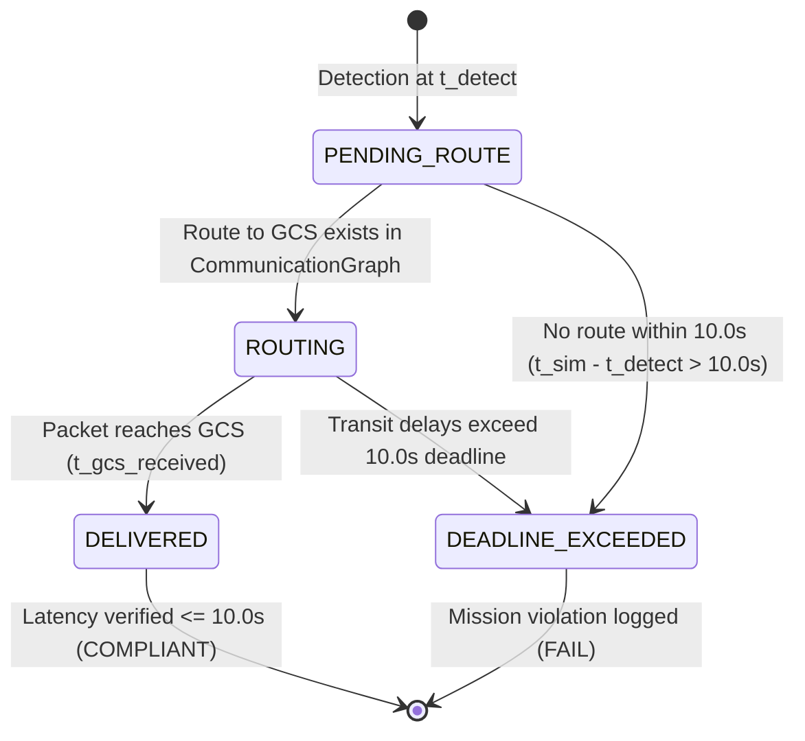

# Communication & Telemetry Architecture

## 1. Overview & Operational Mandate

In emergency disaster response, discovering survivors or hazards is only actionable if intelligence reaches the operational command center within actionable time limits. The UAV-X Challenge establishes a strict real-time constraint:
> *"Detection to reporting to center $\le 10\,\text{s}$."*

AetherSwarm decomposes this mandate into two coupled, deterministic subsystems:
1. **Radio Frequency (RF) Mesh Network Subsystem**: Physical link propagation modeling, dynamic topology maintenance via NetworkX, and shortest-path packet routing across multi-hop aerial relays.
2. **Detection & Telemetry Dissemination Subsystem**: Physical sensor field-of-view (FOV) perception, electronic packet assembly, local buffer queueing, and end-to-end latency accounting.

---

## 2. Physical RF Communication Model

The communication subsystem resides in [`ares_swarm/communication/`](file:///home/dell/swarm_ws/AetherSwarm/src/ares_swarm/communication/) and implements a simulated wireless ad-hoc mesh networking model between airborne UAVs and the Ground Control Station (GCS). 

> [!NOTE]
> **Simulated Model vs. Hardware RF**:
> All packet delivery rates, path-loss curves, and link ranges described herein are **simulation model primitives** executed within the Stage-1 deterministic software engine. They represent simulated communication constraints rather than physical RF hardware lab or field measurements.

```
   GCS (-75, 500)
       ▲
       │ Link 1: d <= 100m (simulated PDR >= 0.85)
       ▼
   UAV Relay 1
       ▲
       │ Link 2: d <= 100m (simulated PDR >= 0.85)
       ▼
   UAV Surveyor (POI Detected)
```

### 2.1 Simulated Link Range ($R_{\text{comm}}$) vs. Planning Range ($R_{\text{eff}}$)
- **Simulated Hard Cut-off ($R_{\text{comm}} = 100.0\,\text{m}$)**:
  Two nodes $u$ and $v$ can establish a bidirectional RF link if and only if their 2D Euclidean separation satisfies:
  $$d(u, v) = \|\mathbf{p}_u - \mathbf{p}_v\|_2 \le R_{\text{comm}} = 100.0\,\text{m}$$
  Any distance $d > 100.0\,\text{m}$ results in instantaneous link severance ($0.0\%$ reception probability).
- **Planning Effective Range ($R_{\text{eff}} = 95.0\,\text{m}$)**:
  Autonomy planners never place relays at the absolute $100.0\,\text{m}$ boundary. A $5\%$ conservative margin ($5.0\,\text{m}$) is enforced to guarantee connectivity despite position discretization and minor kinematic lag.

### 2.2 Packet Delivery Rate (PDR) Model
For nodes within range ($d \le 100.0\,\text{m}$), link quality is modeled using a distance-dependent path loss curve in [`ChannelModel`](file:///home/dell/swarm_ws/AetherSwarm/src/ares_swarm/communication/channel.py):

$$\text{PDR}(d) = \begin{cases} 
1.0 & \text{for } d \le 50.0\,\text{m} \\
1.0 - 0.15 \cdot \left(\frac{d - 50.0}{50.0}\right) & \text{for } 50.0\,\text{m} < d \le 100.0\,\text{m} \\
0.0 & \text{for } d > 100.0\,\text{m}
\end{cases}$$

At the planning range limit ($d = 95.0\,\text{m}$), link PDR remains above $\approx 86.5\%$, ensuring high transmission reliability across hops.

---

## 3. Communication Graph & Multi-Hop Routing

The dynamic network state is tracked by [`CommunicationGraph`](file:///home/dell/swarm_ws/AetherSwarm/src/ares_swarm/communication/graph.py) using an undirected NetworkX graph $G = (V, E)$.

### 3.1 Graph Construction
At each simulation tick:
1. Vertices $V$ include all active, non-failed UAVs plus the fixed GCS node at $(-75.0, 500.0)$.
2. Edges $E$ are evaluated for all node pairs where $d(u, v) \le 100.0\,\text{m}$.
3. Inactive or failed vehicles (`FailureStatus.FAILED`) are immediately pruned, severing incident edges.

### 3.2 Routing Engines
- **Dijkstra Router ([`DijkstraRouter`](file:///home/dell/swarm_ws/AetherSwarm/src/ares_swarm/communication/routing.py))**:
  Finds the minimum-hop route between any active UAV and the GCS. Used as the authoritative routing solver for telemetry delivery.
- **Weighted Router ([`WeightedRouter`](file:///home/dell/swarm_ws/AetherSwarm/src/ares_swarm/communication/weighted_routing.py))**:
  Calculates route costs weighted by combined path loss and hop count:
  $$w(e) = \alpha \cdot \frac{d}{R_{\text{comm}}} + (1 - \alpha) \cdot (1 - \text{PDR}(d))$$
  Used for reliability-sensitive diagnostic routing.

---

## 4. Sensor FOV Perception Pipeline

Perception modeling is separated from task scheduling. In [`DetectionPipeline`](file:///home/dell/swarm_ws/AetherSwarm/src/ares_swarm/telemetry/detection.py), sensor discovery is modeled as a physical geometric intersection.

```
            [UAV Surveyor]
                  │
             .────┼────.
          .       │       .   Sensor Field of View
        .         │         . (R_fov = 40.0m)
       .          ▼          .
      .         [POI]         .  t_detect triggered!
       .                     .
        .                   .
          .               .
             .─────────.
```

### 4.1 Radial Sensor FOV ($R_{\text{fov}}$)
- Sensor footprint is modeled as an omnidirectional downward-looking disk:
  $$R_{\text{fov}} = 40.0\,\text{m}$$
- Detection Trigger: At each tick, for every airborne active UAV and every unserviced POI:
  $$\|\mathbf{p}_{\text{uav}} - \mathbf{p}_{\text{poi}}\|_2 \le R_{\text{fov}} \implies \text{Detection Event Triggered}$$
- Timestamp of detection is recorded as $t_{\text{detect}} = t_{\text{sim}}$.

### 4.2 Decoupling from Task Servicing
Target detection is explicitly decoupled from task loiter inspection:
- **Detection ($t_{\text{detect}}$)**: Occurs the instant the vehicle enters $40.0\,\text{m}$ radius of the POI. Initiates the $10.0\,\text{s}$ telemetry delivery clock.
- **Service Loiter ($t_{\text{service}}$)**: The physical inspection period (e.g. $10\,\text{s}$ to $30\,\text{s}$ stationary hover) required to complete the task. A task can be detected and reported to GCS long before service is complete.

---

## 5. Telemetry Dissemination Lifecycle & Latency Assessment

When a detection occurs, the discovering UAV packages the sighting into an electronic [`TelemetryPacket`](file:///home/dell/swarm_ws/AetherSwarm/src/ares_swarm/telemetry/packet.py).



### 5.1 Telemetry Packet States

| State | Definition | Next Event |
| :--- | :--- | :--- |
| `PENDING_ROUTE` | Packet generated and buffered in discovering UAV's memory. Awaiting a valid multi-hop path to GCS. | Transitions to `ROUTING` when Dijkstra path exists, or `DEADLINE_EXCEEDED` if timeout expires. |
| `ROUTING` | Packet traversing active mesh edges across intermediate relay UAVs toward GCS. | Transitions to `DELIVERED` upon GCS reception, or `DEADLINE_EXCEEDED` if propagation stalls. |
| `DELIVERED` | Packet received at GCS node. Arrival timestamp $t_{\text{gcs\_received}}$ recorded. | End-to-end reporting latency calculated: $t_{\text{gcs\_received}} - t_{\text{detect}}$. |
| `DEADLINE_EXCEEDED` | Total elapsed duration exceeds $10.0\,\text{s}$ before packet reaches GCS. | Recorded as a fatal challenge compliance violation. |

### 5.2 Latency Accounting Formula
End-to-end reporting latency is evaluated strictly as:

$$\Delta t_{\text{report}} = t_{\text{gcs\_received}} - t_{\text{detect}}$$

A detection is certified **COMPLIANT** if and only if:
$$\Delta t_{\text{report}} \le 10.0\,\text{s}$$

If a discovering UAV is partitioned from GCS (no multi-hop route), the packet is buffered locally. If connectivity is restored and the packet arrives at $t_{\text{gcs\_received}} \le t_{\text{detect}} + 10.0\,\text{s}$, the report is compliant. If the partition persists for $> 10.0\,\text{s}$, it transitions to `DEADLINE_EXCEEDED`.

---

## 6. Verification & Telemetry Metrics

Subsystem correctness is validated by 15 tests in [`tests/telemetry/test_detection_reporting.py`](file:///home/dell/swarm_ws/AetherSwarm/tests/telemetry/test_detection_reporting.py).

Official telemetry metrics reported in [`MissionMetricsReport`](file:///home/dell/swarm_ws/AetherSwarm/src/ares_swarm/evaluation/metrics.py):
- `total_detections`: Cumulative count of physical POI discoveries.
- `reports_delivered`: Count of telemetry reports successfully delivered to GCS.
- `reports_within_deadline`: Detections where $\Delta t_{\text{report}} \le 10.0\,\text{s}$.
- `reporting_compliance_pct`: Percentage of deliveries satisfying the $10.0\,\text{s}$ limit:
  $$\text{compliance\_pct} = \frac{\text{reports\_within\_deadline}}{\text{total\_detections}} \times 100.0\%$$
- `avg_reporting_latency_s`: Mean end-to-end latency across all delivered reports.
- `max_reporting_latency_s`: Worst-case latency observed during the mission.
