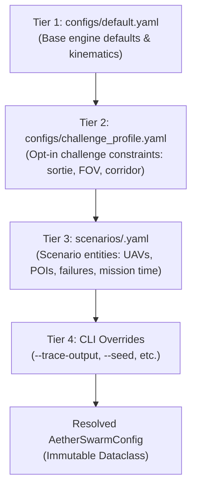

# Configuration & Scenario Generation Architecture

## 1. Overview & 4-Tier Configuration Hierarchy

AetherSwarm employs a strictly hierarchical, centralized configuration model managed by [`AetherSwarmConfig`](file:///home/dell/swarm_ws/AetherSwarm/src/ares_swarm/simulation/scenario.py). Physical constants, operational thresholds, fleet dimensions, and airspace boundaries are never hardcoded inside core algorithms; they are defined in structured YAML configurations and resolved hierarchically at runtime.



### Configuration Priority Resolution
1. **Tier 1 (Base Engine Defaults)**: `configs/default.yaml` defines the fundamental kinematic limits ($v_{\max} = 5.0\,\text{m/s}$), baseline communication parameters ($R_{\text{comm}} = 100.0\,\text{m}$), and allocation utility weights.
2. **Tier 2 (Challenge Profile Overrides)**: `configs/challenge_profile.yaml` activates opt-in challenge safety constraints (the 1200s sortie limit, $20\,\text{m}$ separation metric, $40\,\text{m}$ sensor FOV, and composite transit corridor). When `challenge_profile.enabled = false`, the engine executes in legacy unconstrained mode.
3. **Tier 3 (Scenario Definition)**: `scenarios/<scenario>.yaml` defines scenario-specific entities: initial UAV staging coordinates, POI coordinates, priority ratings, loiter service durations, and scheduled hardware failure injection events.
4. **Tier 4 (CLI Runtime Flags)**: Command-line arguments passed to the runner override configuration fields (e.g. `--trace-output`, `--max-ticks`, or `--seed`).

---

## 2. Configuration Schema & Key Parameters

### 2.1 Complete Parameter Reference

```yaml
# Tier 1 & 2 Consolidated Architecture Example
simulation:
  time_step_s: 1.0                        # Synchronous tick step
  max_ticks: 2700                         # 45 minutes continuous duration
  random_seed: 2026                       # Deterministic pseudo-random seed

fleet:
  speed_max_m_s: 5.0                      # Max horizontal velocity
  accel_max_m_s2: 2.0                     # Max acceleration
  battery_capacity_wh: 120.0              # Nominal battery energy
  recharge_duration_s: 300.0              # Ground battery replenishment time (5 min)

communication:
  comm_range_m: 100.0                     # Physical RF range cutoff (R_comm)
  planning_effective_range_m: 95.0        # Conservative planning link range (R_eff)
  channel_model: "friis"                  # RF path loss formulation

safety:
  min_separation_m: 20.0                  # Minimum inter-UAV horizontal distance
  separation_metric: "2D"                 # 2D planar enforcement (3D diagnostic)
  enforce_geofence: true
  max_sortie_duration_s: 1200.0           # 20-minute continuous flight ceiling
  rth_safety_margin_s: 15.0               # Preemptive return safety buffer
  rth_stagger_interval_s: 8.0             # Per-vehicle arrival separation offset

telemetry:
  sensor_fov_radius_m: 40.0               # Perception discovery footprint (R_fov)
  reporting_deadline_s: 10.0              # Mandatory detection-to-reporting deadline
  processing_delay_s: 0.0

airspace:
  staging_pad_center: [-75.0, 500.0]      # Authoritative GCS coordinates
  staging_pad_radius_m: 15.0
  corridor_x_bounds: [-75.0, 0.0]         # Transit corridor longitude
  corridor_y_bounds: [400.0, 600.0]       # Transit corridor latitude (200m width)
  arena_x_bounds: [0.0, 1000.0]           # Operational arena search bounds
  arena_y_bounds: [0.0, 1000.0]
  max_height_m: 100.0                     # Operational ceiling (metadata / Webots)
```

---

## 3. Randomized Scenario Generator

To evaluate autonomy and multi-hop relay planning beyond fixed scenarios, [`scripts/generate_scenario.py`](file:///home/dell/swarm_ws/AetherSwarm/scripts/generate_scenario.py) provides a reproducible, seed-based generator.

### 3.1 Spatial Distribution Mechanics
Points of Interest (POIs) are placed across the operational arena using continuous uniform sampling:
$$x_{\text{poi}} \sim \mathcal{U}(5.0, 995.0), \quad y_{\text{poi}} \sim \mathcal{U}(5.0, 995.0)$$
A $5.0\,\text{m}$ buffer inside the arena boundary ($[0, 1000]^2$) prevents edge boundary clipping.

### 3.2 Fleets & Staging Placement
- Fleet size is **not fixed** at 5 or 8 by the simulation engine; it is configurable via `--num-uavs`.
- Ground staging positions are automatically spaced inside the GCS staging corridor near $(-75.0, 500.0)$, maintaining the mandatory $20\,\text{m}$ initial separation.

### 3.3 CLI Invocation & Options

```bash
python scripts/generate_scenario.py \
  --seed <INT> \
  --num-uavs <INT> \
  --num-pois <INT> \
  --output <PATH> \
  [--emergency-fraction <FLOAT>] \
  [--min-service-time <FLOAT>] \
  [--max-service-time <FLOAT>]
```

#### Argument Reference

| Argument | Type | Default | Description |
| :--- | :---: | :---: | :--- |
| `--seed` | `int` | `2026` | Random number generator seed for 100% reproducible scenario geometry. |
| `--num-uavs` | `int` | `8` | Number of UAV airframes deployed at the GCS staging pad. |
| `--num-pois` | `int` | `10` | Total number of POIs distributed across the arena. |
| `--output` | `str` | `None` | Path to destination YAML file. If omitted, prints to `stdout`. |
| `--emergency-fraction`| `float` | `0.2` | Proportion of POIs designated as high-urgency emergency tasks. |
| `--min-service-time` | `float` | `10.0` | Minimum stationary loiter inspection time required per POI (seconds). |
| `--max-service-time` | `float` | `30.0` | Maximum stationary loiter inspection time required per POI (seconds). |

### 3.4 Authoritative Validation Seeds

Three standardized seeds are utilized across official evaluation benchmarks:

| Seed | Characterization | Nearest POI to GCS | Farthest POI to GCS | Max Relay Hops Needed |
| :---: | :--- | :---: | :---: | :---: |
| **`2026`** | Balanced spatial distribution; mix of near and deep-arena targets. | $161.4\,\text{m}$ | $1042.8\,\text{m}$ | $11$ hops |
| **`42`** | Clustered perimeter targets; single near-corridor entry POI. | $178.2\,\text{m}$ | $1112.5\,\text{m}$ | $12$ hops |
| **`5001`** | Deep-arena concentration; zero targets within single-relay range. | $542.4\,\text{m}$ | $1168.1\,\text{m}$ | $13$ hops |

---

## 4. Benchmark Scenario E1 (`scenarios/poc_round1.yaml`)

The repository maintains `scenarios/poc_round1.yaml` as the **frozen Benchmark E1 regression standard**:
- **Duration**: $2700.0\,\text{s}$ (45 minutes, 2,700 ticks).
- **Fleet**: 5 UAVs (`uav_1` through `uav_5`).
- **Injected Failure**: Hardware failure injected at tick $300.0$ on `uav_3`.
- **Purpose**: Verifies that new autonomy or safety extensions never break the historical Stage 1 baseline.
