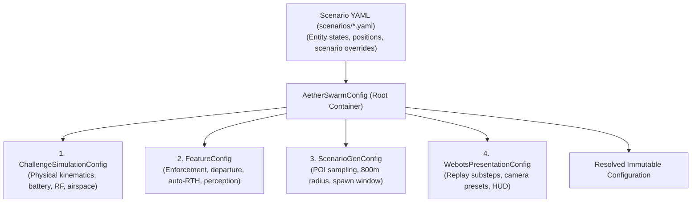

# Configuration & Scenario Generation Architecture

## 1. Overview & Centralized Configuration Architecture

AetherSwarm employs a centralized, strongly-typed, immutable configuration architecture rooted in [`AetherSwarmConfig`](file:///home/dell/swarm_ws/AetherSwarm/src/ares_swarm/config/root.py). Physical constants, operational thresholds, fleet dimensions, and airspace boundaries are never hardcoded inside core algorithms; they are defined in typed Python dataclasses under `src/ares_swarm/config/` and can be overridden by scenario YAML definitions or runtime CLI flags.


```mermaid
flowchart TD
    Root["AetherSwarmConfig (Root Container)"]
    L1["1. ChallengeSimulationConfig\n(Physical kinematics, battery, RF, airspace)"]
    L2["2. FeatureConfig\n(Enforcement, departure, auto-RTH, perception)"]
    L3["3. ScenarioGenConfig\n(POI sampling, 800m radius, spawn window)"]
    L4["4. WebotsPresentationConfig\n(Replay substeps, camera presets, HUD)"]
    YAML["Scenario YAML (scenarios/*.yaml)\n(Entity states, positions, scenario overrides)"]

    Root --> L1
    Root --> L2
    Root --> L3
    Root --> L4
    YAML --> Root
    Root --> Resolved["Resolved Immutable Configuration"]
```

### Configuration Priority Resolution
1. **Dataclass Defaults (`src/ares_swarm/config/`)**: Fundamental kinematic limits ($v_{\max} = 5.0\,\text{m/s}$), RF link limits ($R_{\text{comm}} = 100.0\,\text{m}$, $R_{\text{eff}} = 95.0\,\text{m}$), and airspace definitions.
2. **Scenario YAML Files (`scenarios/<name>.yaml`)**: Scenario-specific initial entity states, UAV fleet definitions (battery capacity, initial staging coordinates), known POIs, emerging hidden POIs, and injected hardware failures.
3. **CLI Runtime Flags**: Command-line arguments passed to runners and generator scripts (e.g. `--final-profile`, `--seed`, `--max-ticks`, `--max-radius`).

---

## 2. Configuration Schema & Key Parameters

### 2.1 Complete Parameter Reference

```yaml
# Authoritative Scenario Configuration Example (e.g. scenarios/random_seed_2026.yaml)
simulation:
  time_step_s: 1.0                        # Synchronous tick step (dt)
  max_ticks: 2700                         # 45 minutes continuous mission duration
  random_seed: 2026                       # Deterministic pseudo-random seed

fleet:
  num_uavs: 8                             # Swarm fleet size
  speed_max_m_s: 5.0                      # Max horizontal velocity (v_max)
  accel_max_m_s2: 2.0                     # Max acceleration
  battery_capacity_wh: 7560.0             # Current configured capacity (4200 Wh baseline x 1.8)
  battery_energy_wh: 7560.0               # Initial full energy state
  recharge_duration_s: 300.0              # Ground battery replenishment time (5 min)
  departure_spacing_s: 6.0                # Ground departure sequencing interval

autonomy:
  allocator_reassessment_interval_s: 5.0  # Periodic allocator cadence (~5s)
  relay_station_tolerance_m: 5.0          # Physical relay arrival tolerance
  planning_effective_range_m: 95.0        # Conservative planning link range (R_eff)

communication:
  comm_range_m: 100.0                     # Physical RF range cutoff (R_comm)
  channel_model: "friis"                  # RF path loss formulation

safety:
  min_separation_m: 20.0                  # Minimum inter-UAV horizontal distance
  separation_metric: "2D"                 # 2D planar enforcement (3D diagnostic)
  enforce_geofence: true
  max_sortie_duration_s: 1200.0           # 20-minute continuous flight ceiling
  rth_safety_margin_s: 15.0               # Preemptive return safety buffer
  rth_stagger_interval_s: 8.0             # Per-vehicle arrival separation offset

telemetry:
  altitude_detection_table:               # Altitude-dependent perception footprint:
    - [20.0, 80.0]                        #   z <= 20m: 80.0m radius (breakpoint; clamped below)
    - [40.0, 130.0]                       #   z = 40m:  130.0m radius (breakpoint)
    - [60.0, 170.0]                       #   z = 60m:  170.0m radius (breakpoint; 50m interpolates to 150m)
    - [80.0, 190.0]                       #   z = 80m:  190.0m radius (breakpoint)
    - [100.0, 230.0]                      #   z >= 100m: 230.0m radius (breakpoint; clamped above)
  reporting_deadline_s: 10.0              # Mandatory detection-to-reporting deadline

airspace:
  staging_pad_center: [-75.0, 500.0]      # Authoritative GCS coordinates
  staging_pad_radius_m: 15.0
  corridor_x_bounds: [-75.0, 0.0]         # Transit corridor longitude
  corridor_y_bounds: [400.0, 600.0]       # Transit corridor latitude (200m width)
  arena_x_bounds: [0.0, 1000.0]           # Operational arena search bounds
  arena_y_bounds: [0.0, 1000.0]
  max_height_m: 100.0                     # Operational ceiling (metadata / Webots)
```

---

## 3. Randomized Scenario Generator

[`scripts/generate_scenario.py`](file:///home/dell/swarm_ws/AetherSwarm/scripts/generate_scenario.py) provides reproducible, seed-based scenario and trace generation.

### 3.1 Spatial Distribution & 800 m Radius Constraint
Points of Interest (POIs) are placed across the operational arena using rejection-sampled uniform placement:
$$x_{\text{poi}} \sim \mathcal{U}(5.0, 995.0), \quad y_{\text{poi}} \sim \mathcal{U}(5.0, 995.0)$$

All generated POIs (both known and hidden) must satisfy the circular distance constraint relative to the GCS staging center at $(-75.0, 500.0)$:
$$(x + 75.0)^2 + (y - 500.0)^2 \le 800.0^2$$

Candidates exceeding $800.0\,\text{m}$ radius are resampled until the exact required count is achieved.

### 3.2 Final-Profile Generation (`--final-profile`)
When `--final-profile` is specified:
- Exactly **5 known POIs** (`poi_01` to `poi_05`) are instantiated and made visible to the planner at $T_0$.
- Exactly **5–7 hidden emerging POIs** (`hidden_poi_01` to `hidden_poi_05` in seed 2026) are instantiated with emergence times $t_{\text{emerge}} \in [0.0, 300.0]\,\text{s}$.
- Hidden POIs remain excluded from the initial planner snapshot and are discovered at runtime via in-flight perception.

### 3.3 CLI Invocation & Options

```bash
# Generate final-profile mission (5 known + 5..7 hidden POIs, 800m radius constraint)
python scripts/generate_scenario.py \
  --seed 2026 \
  --final-profile \
  --max-ticks 2700 \
  --output-scenario scenarios/random_seed_2026.yaml \
  --output-trace visualization/webots/data/random_scenario_trace.json
```

#### Argument Reference

| Argument | Type | Default | Description |
| :--- | :---: | :---: | :--- |
| `--seed` | `int` | `2026` | Random number generator seed for 100% reproducible scenario geometry. |
| `--num-uavs` | `int` | `8` | Number of UAV airframes deployed at the GCS staging pad. |
| `--num-pois` | `int` | `10` | Total number of known POIs (or 5 when `--final-profile` is set). |
| `--num-hidden-pois` | `int` | `0` | Number of hidden POIs (or 5–7 when `--final-profile` is set). |
| `--final-profile` | `flag` | `False` | Activate final profile mode: exactly 5 known + 5–7 hidden POIs. |
| `--max-radius` | `float` | `800.0` | Maximum radial distance from $(-75.0, 500.0)$ in meters. |
| `--min-spacing` | `float` | `0.0` | Minimum pairwise distance between POIs in meters. |
| `--spawn-start` | `float` | `0.0` | Earliest known POI spawn time in seconds. |
| `--spawn-end` | `float` | `300.0` | Latest known POI spawn time in seconds. |
| `--emergence-start` | `float` | `0.0` | Earliest hidden POI emergence time in seconds. |
| `--emergence-end` | `float` | `300.0` | Latest hidden POI emergence time in seconds. |
| `--output-scenario` | `str` | `None` | Path to destination YAML file. |
| `--output-trace` | `str` | `None` | Path to destination Webots JSON trace file. |
| `--max-ticks` | `int` | `2700` | Simulation horizon in ticks. |
| `--no-run` | `flag` | `False` | Skip simulation execution; generate scenario YAML only. |

---

## 4. Benchmark Scenario E1 (`scenarios/poc_round1.yaml`)

The repository maintains `scenarios/poc_round1.yaml` as the **frozen Benchmark E1 regression standard**:
- **Duration**: $2700.0\,\text{s}$ (45 minutes, 2,700 ticks).
- **Fleet**: 5 UAVs (`uav_1` through `uav_5`).
- **Battery**: Baseline $4200.0\,\text{Wh}$ capacity.
- **Injected Failure**: Hardware failure injected at tick $300.0$ on `uav_3`.
- **Purpose**: Verifies that new autonomy or safety extensions never break the historical Stage 1 baseline.
