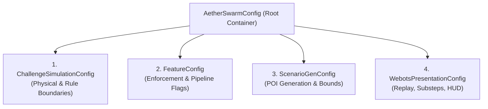

# AetherSwarm Centralized Configuration Architecture

## 1. Overview

AetherSwarm organizes simulation, challenge, scenario, and presentation parameters into four strongly-typed, immutable configuration models unified under a central root container: [`AetherSwarmConfig`](file:///home/dell/swarm_ws/AetherSwarm/src/ares_swarm/config/root.py).

This replaces dispersed magic constants with centralized, schema-validated configuration while preserving 100% backward compatibility for canonical scenarios (such as frozen `poc_round1.yaml`) and downstream consumers.

---

## 2. Configuration Layers & Parameter Locations

### Layer 1: Challenge & Simulation Configuration ([`ChallengeSimulationConfig`](file:///home/dell/swarm_ws/AetherSwarm/src/ares_swarm/config/challenge.py))
Defines the authoritative physical rules and operational boundaries for the UAV-X challenge:

| Parameter | Type | Default Value | Description |
|---|---|---|---|
| `arena_bounds_x` | `tuple[float, float]` | `(0.0, 1000.0)` | Primary operational arena X boundaries (m) |
| `arena_bounds_y` | `tuple[float, float]` | `(0.0, 1000.0)` | Primary operational arena Y boundaries (m) |
| `max_altitude_m` | `float` | `100.0` | Maximum operational ceiling (m) |
| `speed_limit_mps` | `float` | `5.0` | Horizontal physical speed limit (m/s) |
| `min_separation_m` | `float` | `20.0` | Minimum horizontal separation between UAVs (m) |
| `comm_range_m` | `float` | `100.0` | Maximum single-hop RF communication link distance (m) |
| `comm_base_latency_ms` | `float` | `5.0` | Base network latency per hop (ms) |
| `staging_pad_center` | `tuple[float, float]` | `(-75.0, 500.0)` | Takeoff / landing staging pad center (x, y) |
| `staging_pad_radius_m` | `float` | `15.0` | Staging pad circular radius (m) |
| `corridor_bounds_x` | `tuple[float, float]` | `(-75.0, 0.0)` | Ingress/egress transit corridor X interval (m) |
| `corridor_bounds_y` | `tuple[float, float]` | `(450.0, 550.0)` | Ingress/egress transit corridor Y interval (m) |
| `mission_duration_s` | `float` | `2700.0` | Total mission scenario duration (s) |
| `max_sortie_duration_s` | `float` | `1200.0` | Maximum allowable airborne flight duration per sortie (s) |
| `rth_safety_margin_s` | `float` | `15.0` | Reserve time buffer prior to sortie limit expiry (s) |
| `reporting_deadline_s` | `float` | `10.0` | Max allowable delay from POI detection to GCS reception (s) |
| `detection_fov_radius_m` | `float` | `40.0` | Sensor circular ground FOV radius (m) |
| `processing_delay_s` | `float` | `0.0` | Sensor processing delay before transmission (s) |

---

### Layer 2: Feature Configuration ([`FeatureConfig`](file:///home/dell/swarm_ws/AetherSwarm/src/ares_swarm/config/features.py))
Controls active enforcement mechanisms and pipeline modules:

| Parameter | Type | Default Value | Description |
|---|---|---|---|
| `enforce_separation` | `bool` | `False` | Active continuous separation collision avoidance enforcer |
| `enforce_geofence` | `bool` | `False` | Active continuous geofence boundary enforcer |
| `enforce_sortie_limit` | `bool` | `True` | Enforce 1200s sortie duration constraint |
| `enforce_single_sortie` | `bool` | `True` | Prohibit relaunch after landing |
| `enable_detection_pipeline` | `bool` | `False` | Enable perception FOV evaluation & telemetry buffering |
| `enable_auto_rth` | `bool` | `True` | Enable automated return-to-home trigger |
| `return_by_mission_end` | `bool` | `True` | Require all UAVs to land at GCS before mission completion |

---

### Layer 3: Scenario Generation Configuration ([`ScenarioGenConfig`](file:///home/dell/swarm_ws/AetherSwarm/src/ares_swarm/config/scenario.py))
Configures experimental and demo scenario generation:

| Parameter | Type | Default Value | Description |
|---|---|---|---|
| `seed` | `int` | `42` | PRNG seed for deterministic scenario generation |
| `scenario_type` | `str` | `"random_demo"` | Scenario archetype (`canonical`, `random_demo`, `recovery`) |
| `num_pois` | `int` | `10` | Total number of POIs to place |
| `x_range` | `tuple[float, float]` | `(5.0, 995.0)` | Independent uniform sampling bounds for X axis (m) |
| `y_range` | `tuple[float, float]` | `(5.0, 995.0)` | Independent uniform sampling bounds for Y axis (m) |
| `min_spacing_m` | `float` | `0.0` | Minimum POI spacing constraint (0.0 = direct independent uniform sampling; >0 enables rejection sampling) |
| `margin_m` | `float` | `0.0` | Boundary margin applied when explicitly requested |
| `spawn_window_s` | `tuple[float, float]` | `(0.0, 300.0)` | Time window for POI appearances [start_s, end_s] |
| `service_duration_s` | `float` | `2.0` | Service time required to complete POI task (s) |
| `deadline_offset_s` | `float` | `10.0` | Task deadline offset from creation time (s) |

> [!NOTE]
> **Spatial Distribution**: POIs are sampled randomly across the configured arena bounds; the generator does not enforce quadrant or regional distribution. When `min_spacing_m == 0.0`, coordinates are sampled independently from Uniform(5.0, 995.0).

---

### Layer 4: Webots Presentation Configuration ([`WebotsPresentationConfig`](file:///home/dell/swarm_ws/AetherSwarm/src/ares_swarm/config/presentation.py))
Configures the downstream 3D robotics visualization:

| Parameter | Type | Default Value | Description |
|---|---|---|---|
| `sub_steps` | `int` | `4` | Sub-tick visual interpolation steps per 1.0s authoritative tick |
| `sim_mode` | `str` | `"default"` | Playback mode (`default`, `fast`, `realtime`) |
| `default_camera` | `str` | `"demo_presentation_cam"` | Primary viewpoint camera node name |
| `show_comm_mesh` | `bool` | `True` | Render active RF mesh communication links |
| `show_routes` | `bool` | `True` | Render active multi-hop routing paths to GCS |
| `show_drop_lines` | `bool` | `True` | Render vertical ground drop-lines and ground footprints |
| `show_hud` | `bool` | `True` | Render in-world HUD telemetry overlay |
| `show_event_banner` | `bool` | `True` | Render top-center event notification banners |
| `auto_quit` | `bool` | `False` | Terminate Webots automatically when scenario ends |

---

## 3. Configuration Precedence & Overrides

Configuration values are resolved through a clean hierarchy:

1. **Dataclass Defaults**: Built-in defaults in `src/ares_swarm/config/*.py`.
2. **Scenario File (`scenario.yaml`)**:
   - Explicit `config:` block in the scenario file takes precedence.
   - Traditional top-level YAML keys (`speed_limit`, `min_separation_m`, `arena:`) are automatically mapped into the typed configuration model.
3. **Programmatic Overrides**:
   - `AetherSwarmConfig.with_overrides(...)` returns a new immutable instance with targeted modifications.
4. **Environment Variables**:
   - Presentation settings can be overridden at runtime via:
     - `AETHERSWARM_SUBSTEPS` (overrides `sub_steps`)
     - `AETHERSWARM_SIM_MODE` (overrides `sim_mode`)
     - `AETHERSWARM_AUTO_QUIT` (overrides `auto_quit`)

---

## 4. Reproducibility & Trace Immutability

When [`export_trace`](file:///home/dell/swarm_ws/AetherSwarm/scripts/export_webots_trace.py) generates a Webots trace, the active configuration is serialized directly into `trace["metadata"]["config"]`.

This guarantees:
1. **Full Trace Reproducibility**: Exact parameters used during simulation are permanently recorded.
2. **Strict Downstream Decoupling**: The Webots supervisor reads presentation defaults from `trace["metadata"]["config"]["presentation"]`, ensuring the visualization remains an observational consumer without mutating simulation state.
