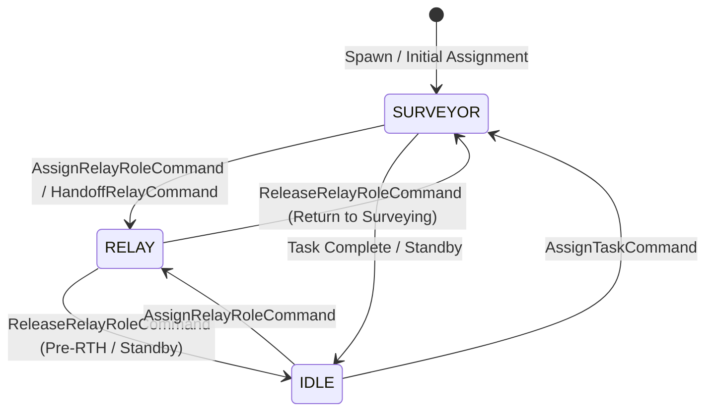

# AetherSwarm Dynamic Relay Role Management (V1)

## 1. Executive Summary & Problem Statement

In the UAV-X Stage 1 mission framework, UAVs must survey points of interest (POIs) uniformly scattered across an expansive $1000 \times 1000\text{ m}$ operational arena with a Ground Control Station (GCS) positioned 75 m outside the western boundary at $(-75.0, 500.0)\text{ m}$. With a direct radio communication range strictly limited to $100\text{ m}$, any surveyor operating deep in the arena ($d_{\text{GCS}} > 100\text{ m}$) requires multi-hop relay forwarding to maintain telemetry and fulfill the 10 s detection-to-GCS reporting deadline.

Previous phases either utilized static formations or relied on uncoordinated opportunistic routing. Phase 3 introduces the **authoritative V1 Dynamic Relay Role Management Layer**:
1. **Explicit Operational Roles**: Introduces `SURVEYOR` and `RELAY` alongside core lifecycle roles, with dynamic, bidirectional transitions (`SURVEYOR \leftrightarrow RELAY`).
2. **Unified Architecture Integration**: Operates directly on the existing communication graph, weighted Dijkstra routing, task allocator, and sortie lifecycle infrastructure—**without creating a second networking stack**.
3. **Dynamic Multi-Factor Relay Candidate Scoring**: Evaluates candidate UAVs based on current GCS connectivity, route PDR, hop count, geometric proximity, task commitments, and remaining sortie endurance.
4. **Endurance & Preemptive RTH Handoff**: Guarantees that a relay is never assigned if it cannot remain on station for the required operational duration. When an active relay approaches its 1200 s continuous sortie limit or battery threshold, it initiates a proactive handoff to an available successor before entering RTH.
5. **Reactive Failure Recovery**: Detects abrupt relay loss (hardware failure or communication cutoff) and autonomously nominates a replacement to restore the GCS link.
6. **Telemetry & Continuity Measurement**: Instruments dedicated metrics measuring connectivity before and after handoff, reconfiguration latency, and relay lifecycle events.

---

## 2. Operational Roles & State Transitions

### 2.1 Role Definitions

| Operational Role | Primary Function | Allocator Eligibility | Communication Function |
| :--- | :--- | :--- | :--- |
| `SURVEYOR` | Navigates to POIs, performs sensor coverage, collects intelligence | **Eligible** for POI task allocation | Endpoint data generator |
| `RELAY` | Maintains optimal intermediate station keeping to bridge GCS and surveyor | **Ineligible** for POI task allocation (protected) | Multi-hop packet forwarder |

### 2.2 Bidirectional Lifecycle Transitions



- **`SURVEYOR \to RELAY`**: When a distant surveyor requires a communication bridge, an available UAV (idle or servicing lower priority) is assigned `Role.RELAY`. If the selected UAV held an active task, that task is atomically deferred (`TASK_HANDOFF` and `TASK_DEFERRED`) back to the task allocator.
- **`RELAY \to SURVEYOR`**: When the supported surveyor completes its mission or returns to GCS range, the relay is released (`RELAY_RELEASED`) back to `Role.SURVEYOR` or `Role.IDLE`, becoming immediately eligible for POI tasks.
- **Integrity Invariant**: Active `RELAY` UAVs are excluded from `eligible_roles` in `TaskAllocatorConfig`, preventing POI task allocation from pulling relays off critical communication bridges.

---

## 3. Dynamic Candidate Selection & Scoring Algorithm

When a surveyor operating at $d_{\text{GCS}} > 90\text{ m}$ loses direct or stable GCS connectivity, `DynamicRelayManager` determines an intermediate geometric station-keeping position:

$$\mathbf{p}_{\text{relay}} = \mathbf{p}_{\text{gcs}} + 0.5 \cdot (\mathbf{p}_{\text{surveyor}} - \mathbf{p}_{\text{gcs}})$$

### 3.1 Hard Feasibility Gates

A candidate UAV $u$ is strictly disqualified if:
1. It is inactive or has a hardware failure (`failure_state \neq FailureState.NORMAL`).
2. It is currently in RTH or landing (`rth_state \neq RTHState.NONE` or `sortie_state \in \{RTH, LANDING, LANDED, RECHARGING\}`).
3. Its remaining sortie duration cannot cover transit to the relay point, minimum required on-station relay duration ($t_{\text{reserve}} \ge 60\text{ s}$), and transit back to GCS:
   $$t_{\text{rem}} < t_{\text{transit\_to\_relay}} + t_{\text{reserve}} + t_{\text{transit\_to\_gcs}}$$
4. Its current battery energy cannot cover the transit energy, idle holding energy, and return energy with safety margins:
   $$E_{\text{batt}} < E_{\text{to\_relay}} + E_{\text{station}} + E_{\text{to\_gcs}} + E_{\text{reserve}}$$

### 3.2 Dynamic Scoring Formulation

All eligible candidate UAVs are evaluated via a multi-objective utility function:

$$\mathcal{U}(u) = \mathcal{S}_{\text{role}} - \mathcal{C}_{\text{dist}} + \mathcal{S}_{\text{conn}} + \mathcal{S}_{\text{pdr}} - \mathcal{C}_{\text{hop}} + \mathcal{S}_{\text{batt}}$$

Where:
- **Role Preference ($\mathcal{S}_{\text{role}}$)**:
  - `IDLE`: $+100.0$ (highest preference; avoids disrupting in-flight operations)
  - `SURVEYOR` without active task: $+60.0$
  - `SURVEYOR` with active task: $+10.0$ (penalized to avoid task preemption)
- **Distance Cost ($\mathcal{C}_{\text{dist}}$)**:
  - $\mathcal{C}_{\text{dist}} = 0.5 \cdot \|\mathbf{p}_u - \mathbf{p}_{\text{relay}}\|$ (minimizes reconfiguration transit delay)
- **Connectivity Bonus ($\mathcal{S}_{\text{conn}}$)**:
  - $+50.0$ if candidate already has a verified connected path to GCS.
- **Link Quality Bonus ($\mathcal{S}_{\text{pdr}}$)**:
  - $+25.0 \times \text{PDR}_{\text{route}}(u, \text{GCS})$.
- **Hop Count Penalty ($\mathcal{C}_{\text{hop}}$)**:
  - $-5.0 \times \min(5, \text{hop\_count})$ (favors direct or shorter links to GCS).
- **Battery Health Bonus ($\mathcal{S}_{\text{batt}}$)**:
  - $+0.2 \times \text{SoC}\%(u)$.

Ties are resolved deterministically by ascending alphabetical UAV ID.

---

## 4. Preemptive Handoff & Failure Recovery

### 4.1 Preemptive RTH Relay Handoff (Workflow)

To honor the 1200 s continuous sortie limit and prevent sudden communication collapse:
1. `DynamicRelayManager` continuously calculates the return time from the relay position to the GCS staging pad:
   $$t_{\text{return}} = \frac{\|\mathbf{p}_{\text{relay}} - \mathbf{p}_{\text{gcs}}\|}{v_{\text{max}}}$$
2. If remaining sortie time $t_{\text{rem}} \le t_{\text{return}} + t_{\text{margin}}$ or battery level reaches return reserve:
   - Identifies an available successor UAV using the candidate selection algorithm.
   - Emits `HandoffRelayCommand` specifying the outgoing relay, incoming replacement, target position, and target surveyor.
   - Emits `RELAY_HANDOFF` and `RELAY_ASSIGNED`.
   - Transitions outgoing relay to `Role.IDLE` via `ReleaseRelayRoleCommand`, emits `RELAY_RELEASED`, and dispatches `StartRTHCommand` to ensure safe, orderly return before sortie exhaustion.

### 4.2 Reactive Hardware Failure Recovery

If an active relay experiences hardware failure (`relay.failure_state != FailureState.NORMAL` or `not relay.active`):
1. Immediately records `relay_losses += 1` and emits `RELAY_LOST`.
2. Inspects remaining swarm assets and nominates the best available replacement candidate.
3. Issues `AssignRelayRoleCommand` and moves the replacement to the relay station.
4. Increments `relay_recovery_successes += 1` and `relay_assignments += 1`, emitting `RELAY_RECOVERY` and `RELAY_ASSIGNED`.

---

## 5. Domain Events & Metrics Instrumentation

### 5.1 Domain Events

| Event Type | Entity | Key Payload Attributes | Trigger Condition |
| :--- | :--- | :--- | :--- |
| `RELAY_ASSIGNED` | Replacement UAV ID | `target_position`, `relay_for_uav_id` | Initial relay assignment, recovery, or handoff |
| `RELAY_RELEASED` | Released UAV ID | `next_role`, `relay_for_uav_id` | Surveyor completion, RTH entry, or role swap |
| `RELAY_HANDOFF` | Outgoing UAV ID | `new_relay_id`, `relay_for_uav_id`, `target_position` | Preemptive RTH or battery handoff |
| `RELAY_LOST` | Failed UAV ID | `failure_type`, `relay_for_uav_id` | In-flight hardware failure of active relay |
| `RELAY_RECOVERY` | Recovered UAV ID | `failed_relay_id`, `surveyor_id` | Successful assignment of recovery replacement |

### 5.2 Metrics Summary

Phase 3 adds 8 authoritative metrics to `MissionMetricsReport`:

```json
{
  "relay_assignments": 1,
  "relay_releases": 1,
  "relay_handoffs": 1,
  "relay_losses": 0,
  "relay_recovery_successes": 0,
  "connected_time_before_handoff": 56.0,
  "connected_time_after_handoff": 244.0,
  "network_reconfiguration_time_s": 1.0
}
```

- **`connected_time_before_handoff`**: Cumulative duration (s) during which the surveyor maintained verified GCS connectivity through the initial relay prior to handoff.
- **`connected_time_after_handoff`**: Cumulative duration (s) during which the surveyor maintained verified GCS connectivity after handoff completion.
- **`network_reconfiguration_time_s`**: Elapsed time (s) from handoff initiation to the first verified GCS routing link established by the new relay.

---

## 6. Verification & Test Suite

The dynamic relay role management layer is validated by 8 dedicated deterministic unit and integration tests in `tests/test_dynamic_relay_management.py`:

1. `test_surveyor_becoming_relay`: Verifies transition `SURVEYOR \to RELAY`, task deferral, and `RELAY_ASSIGNED` emission.
2. `test_relay_becoming_surveyor`: Verifies transition `RELAY \to SURVEYOR` and `RELAY_RELEASED` emission.
3. `test_relay_loss_on_failure`: Verifies `FailUAVCommand` triggers `RELAY_LOST` for an active relay.
4. `test_relay_replacement_and_recovery`: Verifies hardware failure triggers candidate selection, recovery assignment, and `RELAY_RECOVERY`.
5. `test_relay_rth_causing_handoff`: Verifies `StartRTHCommand` on relay releases role cleanly.
6. `test_no_eligible_relay_available`: Proves candidate selector returns `None` when all UAVs fail endurance/RTH feasibility gates.
7. `test_deterministic_repeatability`: Verifies identical event stream and bitwise reproducible simulation metrics across runs.
8. `test_integrated_relay_handoff_scenario`: Full multi-UAV mission (UAV A surveys at $(100, 500)$, UAV B relays at $(15, 500)$, B enters RTH, UAV C assumes relay, route reconfigures in 1.0 s, mission achieves 100% completion with 99.9% connectivity availability and zero battery exhaustions).

**Full Test Suite**: 315 tests passing across the entire repository (100% green).

---

## 7. Current V1 Limitations & Phase 4 Roadmap

1. **Single-Hop Midpoint Placement**:
   - V1 calculates the relay coordinate as the geometric midpoint between GCS and the surveyor. For deep arena operations ($d > 200\text{ m}$), multi-hop relay chains ($K \ge 2$) will be addressed in future phases.
2. **Predictive Replacement Dispatch**:
   - In V1, the replacement UAV departs from standby at the moment handoff is triggered. In future phases, replacement UAVs will depart earlier to arrive on station prior to the outgoing relay's departure, eliminating transit reconfiguration gap.
3. **Dynamic Topology Adaptation**:
   - When multiple surveyors operate concurrently, future iterations will introduce multi-agent Steiner tree or Voronoi clustering to optimize relay sharing across multiple surveyors.
