# AetherSwarm Phase 1: Fleet-Size Feasibility Study

> [!IMPORTANT]
> **PRE-ROTATION FLEET FEASIBILITY BASELINE**
> This study evaluates the minimum UAV fleet size required by the **CURRENT authoritative AetherSwarm working model** under UAV-X Stage 1 mission constraints.
>
> The current system operates as a single-wave deployment baseline and **does not yet implement the final 20-minute multi-wave recharge / battery-swap / return / handoff architecture**.
>
> Therefore, this study establishes the empirical pre-rotation feasibility baseline. It does **not** represent the final minimum fleet required for the completed 45-minute resilient swarm architecture.

---

## Executive Summary & Key Findings

A comprehensive, deterministic experimental sweep of **160 simulations** was executed across fleet sizes $N = 1$ through $16$ under 10 deterministic challenge seeds (`42`, `2026`, `1001`, `2027`, `3001`, `4001`, `5001`, `6001`, `7001`, `8001`) with unconstrained independent uniform POI placement ($x, y \in [5.0, 995.0]$) and $10\,\text{s}$ detection-to-GCS reporting deadline.

### Key Threshold Identifications

| Evaluated Dimension | Smallest Fleet Size ($N$) | Evaluation & Operational Context |
|---|:---:|---|
| **Smallest $N$ with all 10 POIs completed consistently** | **None** ($N > 16$) | Mission completion reaches $80\%$ at $N=16$ (avg completion rate $98\%$, $9.8/10$ POIs). Seeds `2027` and `5001` have extreme far-corner POIs ($>1070\,\text{m}$ and $>1109\,\text{m}$) where single-sortie flight limits and return-transit buffers timeout before service completion. First seed completes all 10 POIs at $N=4$ (seed `42`, `8001`). |
| **Smallest $N$ with communication / reporting success** | **None** ($N > 16$) | In the current model, $A1TaskAllocator$ assigns all active UAVs to task locations without holding back dedicated stationary communication relay nodes. Dispersed UAVs at $500\text{--}1100\,\text{m}$ lack unbroken multi-hop paths to GCS within the $10\,\text{s}$ discovery deadline, causing discovery reports to exceed deadlines. |
| **Smallest $N$ with safety success** | **$N = 1$** ($100\%$ across all $N$) | Zero separation violations and zero geofence violations observed across **all 160 runs** ($N=1\dots16$). $SeparationEnforcer$ and $GeofenceEnforcer$ maintained minimum pairwise separation $\ge 20.00\,\text{m}$ at all times. |
| **Smallest $N$ with all conditions simultaneously satisfied (`FULL_SUCCESS`)** | **None** ($N > 16$) | `FULL_SUCCESS = Mission && Comm && Safety && Endurance && Landing`. While Safety is $100\%$ satisfied for all $N$, Comm fails due to lack of relay stationing, and Landing/Endurance timeout for $N \ge 2$ due to GCS landing-point convergence deconfliction holding. |

---

## 1. Theoretical Geometric Lower Bound vs. Empirical Current-Model Result

A critical distinction must be drawn between the purely geometric chain bound and the actual empirical behavior of the swarm:

```mermaid
flowchart TD
    subgraph Geometric ["Theoretical Geometric Lower Bound (Passive Static Chain)"]
        G1["GCS at [-75.0, 500.0]"] --> G2["Farthest Corner at [1000.0, 1000.0]<br/>Distance: 1185.6 m"]
        G2 --> G3["RF Link Range: 100 m / hop"]
        G3 --> G4["Geometric Lower Bound = ceil(1185.6 / 100) = 12 UAVs"]
        G4 -.-> G5["12 UAVs is ONLY an idealized straight-line passive chain.<br/>Does NOT account for task inspection, motion, or multi-target coverage."]
    end

    subgraph Empirical ["Empirical Current-Model Result (AetherSwarm Autonomy)"]
        E1["A1 Task Allocator"] --> E2["Dispatches active UAVs directly to POIs"]
        E2 --> E3["Zero dedicated relay stations deployed"]
        E3 --> E4["At N = 12..16: UAVs disperse across arena"]
        E4 --> E5["Telemetry reports time out after 10 s (> 100 m from GCS)"]
        E5 --> E6["Empirical Full Success = 0 / 160 runs"]
    end
```

### Clarification on the "12 UAV" Figure:
- **12 UAVs is NOT the operational answer**.
- 12 is merely the **theoretical geometric lower bound** required to bridge a straight-line Euclidean distance of $1185.6\,\text{m}$ (from GCS at $[-75.0, 500.0]$ to the extreme corner $[1000.0, 1000.0]$) assuming:
  1. UAVs are pre-positioned as static, non-moving radio repeater towers exactly $98.8\,\text{m}$ apart.
  2. Zero UAVs are assigned to actually visit, inspect, or service the POI.
  3. No other POIs exist in any other sector of the $1000\times 1000\,\text{m}$ arena.
- In reality, the operational swarm must simultaneously service up to 10 randomly dispersed POIs, enforce $\ge 20\,\text{m}$ safety separation, and return before $1200\,\text{s}$.

---

## 2. Table 1: Fleet Size ($N$) vs. Success Rates

Run classification criteria evaluated independently per seed:
- **MISSION_SUCCESS**: Exactly 10/10 POIs completed ($100\%$ completion rate).
- **COMMUNICATION_SUCCESS**: All 10 POIs detected and reported to GCS within $10.0\,\text{s}$ deadline (`reports_delivered == 10`, `reports_deadline_exceeded == 0`, `compliance == 1.0`).
- **SAFETY_SUCCESS**: Zero separation violations, zero geofence violations, zero altitude violations, observed min separation $\ge 20.00\,\text{m}$.
- **ENDURANCE_SUCCESS**: Zero battery exhaustions, continuous sortie duration $\le 1200.0\,\text{s}$.
- **LANDING_SUCCESS**: All active UAVs safely returned and parked at GCS (`RTHState.COMPLETE`), zero landing location violations.
- **FULL_SUCCESS**: `MISSION && COMM && SAFETY && ENDURANCE && LANDING`.

| Fleet Size ($N$) | Total Runs | Mission Success | Comm Success | Safety Success | Endurance Success | Landing Success | Full Success |
|---|:---:|:---:|:---:|:---:|:---:|:---:|:---:|
| **N = 1** | 10 | 0/10 (0%) | 0/10 (0%) | 10/10 (100%) | 10/10 (100%) | 10/10 (100%) | **0/10 (0%)** |
| **N = 2** | 10 | 0/10 (0%) | 0/10 (0%) | 10/10 (100%) | 5/10 (50%) | 5/10 (50%) | **0/10 (0%)** |
| **N = 3** | 10 | 0/10 (0%) | 0/10 (0%) | 10/10 (100%) | 2/10 (20%) | 3/10 (30%) | **0/10 (0%)** |
| **N = 4** | 10 | 2/10 (20%) | 0/10 (0%) | 10/10 (100%) | 0/10 (0%) | 0/10 (0%) | **0/10 (0%)** |
| **N = 5** | 10 | 2/10 (20%) | 0/10 (0%) | 10/10 (100%) | 0/10 (0%) | 0/10 (0%) | **0/10 (0%)** |
| **N = 6** | 10 | 3/10 (30%) | 0/10 (0%) | 10/10 (100%) | 0/10 (0%) | 0/10 (0%) | **0/10 (0%)** |
| **N = 7** | 10 | 6/10 (60%) | 0/10 (0%) | 10/10 (100%) | 0/10 (0%) | 0/10 (0%) | **0/10 (0%)** |
| **N = 8** | 10 | 6/10 (60%) | 0/10 (0%) | 10/10 (100%) | 0/10 (0%) | 0/10 (0%) | **0/10 (0%)** |
| **N = 9** | 10 | 7/10 (70%) | 0/10 (0%) | 10/10 (100%) | 0/10 (0%) | 0/10 (0%) | **0/10 (0%)** |
| **N = 10** | 10 | 7/10 (70%) | 0/10 (0%) | 10/10 (100%) | 0/10 (0%) | 0/10 (0%) | **0/10 (0%)** |
| **N = 11** | 10 | 7/10 (70%) | 0/10 (0%) | 10/10 (100%) | 0/10 (0%) | 0/10 (0%) | **0/10 (0%)** |
| **N = 12** | 10 | 7/10 (70%) | 0/10 (0%) | 10/10 (100%) | 0/10 (0%) | 0/10 (0%) | **0/10 (0%)** |
| **N = 13** | 10 | 7/10 (70%) | 0/10 (0%) | 10/10 (100%) | 0/10 (0%) | 0/10 (0%) | **0/10 (0%)** |
| **N = 14** | 10 | 7/10 (70%) | 0/10 (0%) | 10/10 (100%) | 0/10 (0%) | 0/10 (0%) | **0/10 (0%)** |
| **N = 15** | 10 | 6/10 (60%) | 0/10 (0%) | 10/10 (100%) | 0/10 (0%) | 0/10 (0%) | **0/10 (0%)** |
| **N = 16** | 10 | 8/10 (80%) | 0/10 (0%) | 10/10 (100%) | 0/10 (0%) | 0/10 (0%) | **0/10 (0%)** |

---

## 3. Table 2: Fleet Size ($N$) vs. Detailed System Metrics

Average metrics computed across all 10 deterministic seeds for each fleet size:

| Fleet Size ($N$) | Avg Completion Rate | Avg Connectivity | Avg Route PDR | Avg Reporting Compliance | Avg Min Separation | Avg Max Sortie Duration |
|---|:---:|:---:|:---:|:---:|:---:|:---:|
| **N = 1** | 25.0% | 6.1% | 0.8084 | 0.0% | N/A (single UAV) | 1185.1 s |
| **N = 2** | 45.0% | 33.7% | 0.7667 | 1.7% | 20.01 m | 1944.0 s |
| **N = 3** | 58.0% | 43.4% | 0.7134 | 1.1% | 20.01 m | 2260.8 s |
| **N = 4** | 67.0% | 54.4% | 0.6731 | 1.4% | 20.01 m | 2699.0 s |
| **N = 5** | 75.0% | 58.1% | 0.6784 | 1.0% | 20.01 m | 2699.0 s |
| **N = 6** | 83.0% | 59.8% | 0.6691 | 2.0% | 20.01 m | 2699.0 s |
| **N = 7** | 92.0% | 60.2% | 0.6836 | 2.0% | 20.01 m | 2699.0 s |
| **N = 8** | 93.0% | 65.5% | 0.7036 | 1.0% | 20.01 m | 2699.0 s |
| **N = 9** | 95.0% | 69.4% | 0.7124 | 1.0% | 20.01 m | 2699.0 s |
| **N = 10** | 95.0% | 72.4% | 0.7238 | 2.0% | 20.01 m | 2699.0 s |
| **N = 11** | 95.0% | 75.4% | 0.7191 | 3.0% | 20.01 m | 2699.0 s |
| **N = 12** | 95.0% | 77.6% | 0.7177 | 2.0% | 20.00 m | 2699.0 s |
| **N = 13** | 95.0% | 79.5% | 0.7209 | 3.0% | 20.00 m | 2699.0 s |
| **N = 14** | 95.0% | 80.9% | 0.7089 | 3.0% | 20.00 m | 2699.0 s |
| **N = 15** | 93.0% | 82.5% | 0.6912 | 3.0% | 20.00 m | 2699.0 s |
| **N = 16** | 98.0% | 83.8% | 0.6830 | 3.0% | 20.00 m | 2699.0 s |

---

## 4. Table 3: Per-Seed Smallest Feasible Fleet Size ($N$)

For each deterministic seed, the smallest fleet size $N \in [1, 16]$ satisfying each condition:

| Seed | Smallest $N$ (Mission) | Smallest $N$ (Comm) | Smallest $N$ (Safety) | Smallest $N$ (Endurance) | Smallest $N$ (Landing) | Smallest $N$ (Full Success) |
|---|:---:|:---:|:---:|:---:|:---:|:---:|
| Seed `42` | **N = 4** | *None (Infeasible)* | **N = 1** | **N = 1** | **N = 1** | **None (Infeasible)** |
| Seed `2026` | **N = 7** | *None (Infeasible)* | **N = 1** | **N = 1** | **N = 1** | **None (Infeasible)** |
| Seed `1001` | **N = 6** | *None (Infeasible)* | **N = 1** | **N = 1** | **N = 1** | **None (Infeasible)** |
| Seed `2027` | *None (Infeasible)* | *None (Infeasible)* | **N = 1** | **N = 1** | **N = 1** | **None (Infeasible)** |
| Seed `3001` | **N = 7** | *None (Infeasible)* | **N = 1** | **N = 1** | **N = 1** | **None (Infeasible)** |
| Seed `4001` | **N = 7** | *None (Infeasible)* | **N = 1** | **N = 1** | **N = 1** | **None (Infeasible)** |
| Seed `5001` | *None (Infeasible)* | *None (Infeasible)* | **N = 1** | **N = 1** | **N = 1** | **None (Infeasible)** |
| Seed `6001` | **N = 9** | *None (Infeasible)* | **N = 1** | **N = 1** | **N = 1** | **None (Infeasible)** |
| Seed `7001` | **N = 6** | *None (Infeasible)* | **N = 1** | **N = 1** | **N = 1** | **None (Infeasible)** |
| Seed `8001` | **N = 4** | *None (Infeasible)* | **N = 1** | **N = 1** | **N = 1** | **None (Infeasible)** |

---

## 5. Geometric Analysis & Hop Distribution Across Seeds

Every scenario places 10 POIs sampled uniformly at random across $[5.0, 995.0] \times [5.0, 995.0]$ with random spawn timestamps in $[0.0, 300.0]\,\text{s}$.

| Seed | Min POI Dist to GCS | Max POI Dist to GCS | Mean POI Dist to GCS | Min Required Hops | Max Required Hops | Corner Reach Feasible in Linear Chain? |
|---|:---:|:---:|:---:|:---:|:---:|:---:|
| Seed `42` | 183.2 m | 1077.1 m | 604.9 m | 2 hops | **11 hops** | Requires $\ge 11$ UAVs |
| Seed `2026` | 172.9 m | 1091.8 m | 682.1 m | 2 hops | **11 hops** | Requires $\ge 11$ UAVs |
| Seed `1001` | 433.4 m | 972.4 m | 743.9 m | 5 hops | **10 hops** | Requires $\ge 10$ UAVs |
| Seed `2027` | 190.6 m | 1070.2 m | 673.1 m | 2 hops | **11 hops** | Requires $\ge 11$ UAVs |
| Seed `3001` | 213.8 m | 1097.7 m | 720.0 m | 3 hops | **11 hops** | Requires $\ge 11$ UAVs |
| Seed `4001` | 292.6 m | 1027.5 m | 704.4 m | 3 hops | **11 hops** | Requires $\ge 11$ UAVs |
| Seed `5001` | 562.7 m | 1109.4 m | 850.6 m | 6 hops | **12 hops** | Requires $\ge 12$ UAVs |
| Seed `6001` | 421.3 m | 1014.9 m | 701.6 m | 5 hops | **11 hops** | Requires $\ge 11$ UAVs |
| Seed `7001` | 98.5 m | 1119.4 m | 575.4 m | 1 hops | **12 hops** | Requires $\ge 12$ UAVs |
| Seed `8001` | 388.2 m | 1038.0 m | 689.9 m | 4 hops | **11 hops** | Requires $\ge 11$ UAVs |

### Spatial Geometry Observations:
1. **Corner Reachability**: In seeds `5001` and `7001`, POIs spawned at distances exceeding $1100\,\text{m}$ from GCS, requiring a geometric minimum of **12 hops** to connect.
2. **Nearest POI**: Seed `7001` contained a POI at $98.5\,\text{m}$ from GCS ($< 100\,\text{m}$ direct comm range). This was the only seed where direct 1-hop telemetry delivery occurred without relays.
3. **Mean POI Distance**: Across all 10 seeds, the average distance from GCS to a POI is **$684.2\,\text{m}$**, which requires an average relay chain of **7 to 8 hops** to maintain continuous GCS contact.

---

## 6. Architectural Analysis & Subsystem Bottlenecks

### A. Mission & Task Servicing Progression
- For $N = 1\dots 3$, the swarm is capacity-starved: single UAVs cover only $2\text{--}5$ POIs before spending their battery budget or triggering RTH.
- At $N = 4\dots 5$, the swarm begins clearing compact seeds (seed `42` and `8001` complete 10/10).
- At $N = 7\dots 14$, completion stabilizes at $70\%$ (7 of 10 seeds complete 10/10; average completion rate $95\%$).
- At $N = 16$, completion reaches $80\%$ (8 of 10 seeds complete 10/10; average completion rate $98\%$).
- **Infeasible Seeds (`2027`, `5001`)**: These seeds have tasks at the far eastern arena boundary ($x > 950\,\text{m}, y > 850\,\text{m}$). Transit from GCS $[-75, 500]$ to $(970, 920)$ requires $1120\,\text{m}$, which at $5\,\text{m/s}$ takes $224\,\text{s}$ one-way ($448\,\text{s}$ round-trip). UAVs servicing intermediate tasks deplete battery reserves and trigger RTH before reaching the far corner.

### B. The Communication & Telemetry Relay Gap
- **Root Cause**: The current $A1TaskAllocator$ incorporates network connectivity signals into utility scoring to *favor* connected UAVs, but it **does not deploy dedicated stationary communication relays**.
- When 10 POIs are unserviced, all available UAVs are dispatched as scouts to separate task coordinates.
- As UAVs fly toward disparate POIs, the initial launch cluster dissolves. Once an airborne UAV moves $> 100\,\text{m}$ from the nearest neighbor or GCS, its link breaks.
- Sensor discovery occurs at $R_{\text{sensor}} = 40\,\text{m}$, buffering a telemetry packet. Because there is no multi-hop route to GCS, the packet remains in the delay-tolerant buffer. After $10.0\,\text{s}$, the reporting deadline expires and the telemetry manager flags `DEADLINE_EXCEEDED`.
- **Finding**: Increasing fleet size from $N=5$ to $N=16$ increases general network connectivity availability from $58.1\%$ to $83.8\%$, but **does not achieve communication success** ($0\%$ compliance) because connectivity is incidental rather than structured.

### C. Safety Assessor & Separation Enforcement
- **$100\%$ Flawless Enforcement**: Across all 160 runs ($432,000$ simulation seconds), **zero separation violations** were recorded.
- Minimum observed separation was maintained at $20.00\text{--}20.01\,\text{m}$ by $SeparationEnforcer$.
- **Zero Geofence Violations**: All UAVs remained strictly within authorized airspace (operational arena $[0, 1000] \times [0, 1000]$ and transit corridor $[-75, 0] \times [400, 600]$).

### D. Endurance & Landing Dynamics Under GCS Convergence
- For $N = 1$, the lone UAV safely completes its sortie and lands at GCS within $1185.1\,\text{s} \le 1200\,\text{s}$.
- For $N \ge 2$, when multiple UAVs simultaneously trigger RTH and converge toward GCS $[-75.0, 500.0]$, the canonical landing threshold requires reaching within $0.05\,\text{m}$ (5 cm) of the single GCS point (`runner.py:442`).
- As multiple UAVs approach the $15\,\text{m}$ staging pad, $SeparationEnforcer$ prevents UAVs from approaching within $20.0\,\text{m}$ of each other.
- The leading UAV approaches the landing threshold, while trailing UAVs are safely held back outside the $20\,\text{m}$ bubble.
- Because trailing UAVs are held in airborne hover awaiting their landing slot, their continuous sortie duration timer continues ticking until the mission window closes ($t = 2699\,\text{s}$), triggering `FLIGHT_DURATION` over-duration flags.
- **Finding**: In a physical swarm, multiple designated landing pads or vertical landing stacks are required to land $> 1$ UAV without horizontal separation deadlocks.

---

## 7. Documented Hidden Hardcoded Assumptions

Per Task Step 1 and 11, the sweep harness exposed several hidden hardcoded assumptions in the pre-existing codebase:

1. **Corridor Sizing vs. Fleet Staging Geometry**:
   - In `scripts/generate_random_scenario.py`, initial UAV positions were generated via a 1D column at $x = -75.0$ with $40\,\text{m}$ spacing:
     $$y_i = 500.0 - \frac{N - 1}{2} \times 40.0 + i \times 40.0$$
   - The transit corridor was hardcoded to $y \in [400.0, 600.0]$ ($200\,\text{m}$ width).
   - For $N \le 5$, all UAVs lay between $y = 420.0$ and $y = 580.0$ (inside the corridor).
   - For $N \ge 6$, the outermost UAVs exceeded $y < 400$ or $y > 600$, triggering instantaneous geofence alarms at tick 0 before any motion began.
   - **Harness Resolution**: The sweep harness implemented multi-lane staging within $[-75, 0] \times [400, 600]$ (two lanes at $x = -75.0$ and $x = -35.0$ with $\ge 25\,\text{m}$ separation), preserving authorized corridor containment for all $N \le 16$.

2. **Scenario Generator UAV Count Parameterization**:
   - In `scripts/generate_scenario.py`, `generate_and_export_scenario()` did not expose or pass `num_uavs` to `generate_scenario_dict()`, defaulting unconditionally to 5 UAVs.
   - In `scripts/generate_random_scenario.py`, the CLI lacked a `--num-uavs` flag.
   - String literals in `validate_scenario_structure_and_feasibility` explicitly cited `"exceeds 5-UAV relay chain reach"`.

3. **Single GCS Landing Point with $0.05\,\text{m}$ Threshold**:
   - `runner.py:442` requires distance to GCS $\le 0.05\,\text{m}$ to transition from `RTHState.ACTIVE` to `RTHState.COMPLETE`.
   - With a $20\,\text{m}$ separation enforcer and a single landing coordinate, concurrent arrivals cannot touch down simultaneously without staggered holding patterns.

---

## 8. Requirements for Phase 2 Architecture

To transition from this pre-rotation baseline to full UAV-X Stage 1 operational compliance:

1. **Dedicated Relay Allocation (A2 Autonomy)**:
   - The task allocator must reserve stationary relay nodes along primary egress corridors to maintain continuous $10\,\text{s}$ reporting paths between active searchers and GCS.
2. **Multi-Wave Recharge / Rotation Architecture**:
   - Implement battery swap / recharge turnaround cycles ($T_{\text{turnaround}} \approx 180\,\text{s}$) so that fleets of $N = 6\text{--}8$ UAVs can sustain continuous 45-minute arena presence without exceeding $1200\,\text{s}$ single-sortie limits.
3. **Staggered / Multi-Pad Touchdown Management**:
   - Expand the staging pad into discrete landing berths separated by $\ge 20\,\text{m}$ to allow concurrent swarm landings without spatial holding deadlocks.

---

## 9. Verification & Test Integrity

- **Pre-Sweep Test Suite**: 300 passed in 17.39s.
- **Post-Sweep Test Suite**: 300 passed in 17.65s (0 failures, 0 regressions).
- **Sweep Artifacts**:
  - `results/fleet_sweep/fleet_sweep_summary.csv` (160 detailed run records)
  - `results/fleet_sweep/fleet_sweep_summary.json` (Aggregates and thresholds)
  - `results/fleet_sweep/geometric_analysis.json` (Full spatial hop calculations)
  - `results/fleet_sweep/per_seed/seed_{seed}.json` (10 per-seed complete files)
