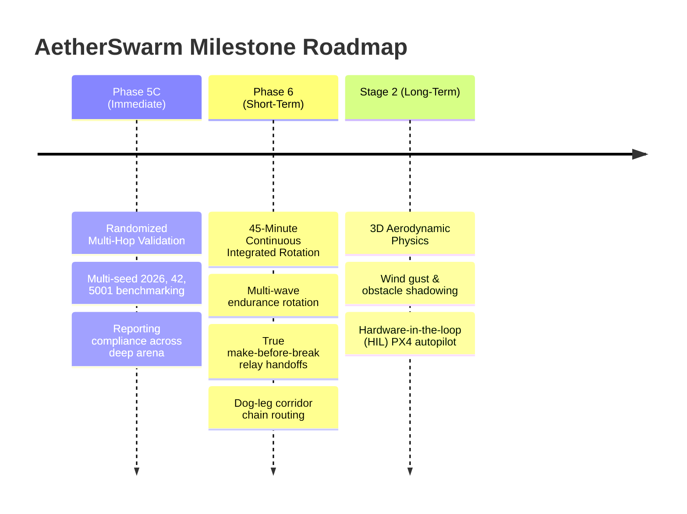

# System Limitations & Technical Roadmap

## 1. Document Purpose & Engineering Transparency

This document provides a transparent, factual accounting of the known architectural and operational limitations of AetherSwarm as of commit `342775b` (Phase 5B). Identifying these limitations ensures clear engineering boundaries and defines the development roadmap for Phase 5C and Phase 6.

---

## 2. Documented Technical Limitations

### 2.1 Localized Relay Handoff Transit Gap
- **Mechanics**: In the current Phase 5B implementation, when an active relay approaches its preemptive RTH deadline (due to the 1200s flight ceiling or battery threshold), the planner dispatches a replacement airframe from the GCS staging pad and commands the incumbent to RTH in the same simulation tick.
- **Limitation**: The replacement UAV travels at $v_{\max} = 5.0\,\text{m/s}$ and incurs a physical transit delay:
  $$t_{\text{transit}} = \frac{\|\mathbf{p}_{\text{station}} - \mathbf{p}_{\text{gcs}}\|_2}{v_{\max}}$$
  During this transit window, station $k$ is temporarily vacant, potentially opening a brief communication partition for downstream nodes until the replacement arrives.
- **Planned Mitigation (Phase 6)**: Implement predictive make-before-break overlap scheduling. The replacement is launched $t_{\text{transit}} + t_{\text{margin}}$ seconds *before* the incumbent's RTH deadline, holding the incumbent on station until the replacement physically enters the station radius.

### 2.2 Straight-Line Lateral Corridor Clipping Risk
- **Mechanics**: Intermediate relay stations are calculated via collinear interpolation along the line segment between GCS at $(-75.0, 500.0)$ and the target POI $(x_p, y_p)$:
  $$\mathbf{p}_{\text{station}}(k) = \mathbf{p}_{\text{gcs}} + \frac{k}{K + 1} \cdot (\mathbf{p}_{\text{poi}} - \mathbf{p}_{\text{gcs}})$$
- **Limitation**: The transit corridor is bounded laterally: $y \in [400.0, 600.0]$ for $x \in [-75.0, 0.0]$. For extreme corner POIs situated near the ingress boundary with extreme lateral coordinates (e.g. $(10.0, 50.0)$ or $(10.0, 950.0)$), the direct line segment from $(-75, 500)$ intersects the corridor boundary before entering the arena at $x = 0$. A relay positioned at $x \in [-75, 0]$ with $y < 400$ or $y > 600$ would violate corridor geofencing.
- **Planned Mitigation (Phase 6)**: Implement piece-wise dog-leg chain routing. Waypoints within $x \in [-75, 0]$ are constrained along the corridor centerline $y = 500.0$, transitioning to the direct line-of-sight only after crossing the arena threshold at $(0.0, 500.0)$.

### 2.3 2D Planar Core Simulation Scope
- **Mechanics**: Kinematic integration, velocity limits, obstacle proximity, and RF range evaluations in `src/ares_swarm/` are calculated in 2D horizontal coordinates ($x, y$).
- **Limitation**: Operational altitude ($z \in [0.0, 100.0\,\text{m}]$) is maintained as metadata in configuration and is verified downstream in the Cyberbotics Webots R2025a supervisor, rather than inside the headless Python loop.
- **Context**: This is an intentional design boundary for Stage 1 (deterministic CPU-only simulation). True 3D kinematic trajectories and aerodynamic lift/drag dynamics are planned for Stage 2.

### 2.4 Single Staging Pad Concentration
- **Mechanics**: All UAV departures and landings occur at a single centralized staging pad: $\mathbf{p}_{\text{gcs}} = (-75.0, 500.0)$ with radius $R_{\text{pad}} = 15.0\,\text{m}$.
- **Limitation**: In large fleet deployments ($N \ge 16$), sequential arrivals require substantial RTH queue staggering ($t_{\text{stagger}} = \text{uav\_index} \times 8.0\,\text{s}$), which forces earlier departures for higher-indexed aircraft.
- **Planned Mitigation**: Multi-pad geometry supporting parallel staging bays along the lateral corridor.

---

## 3. Technical Roadmap

The structured milestone roadmap outlines upcoming capabilities through Stage 1 completion and Stage 2 evolution:

### Phase 5C: Multi-Hop Randomized Validation (Immediate Milestone)
- **Goal**: Execute the authorized multi-seed experimental validation comparing multi-hop performance across seeds `2026`, `42`, and `5001`.
- **Target Deliverables**:
  - Benchmark task completion rates across deep-arena POI distributions.
  - Measure reporting compliance percentages and average delivery latencies across multi-hop chains.
  - Record empirical chain hop counts ($H$) and relay utilization statistics.

### Phase 6: 45-Minute Continuous Integrated Rotation
- **Goal**: Achieve sustained 45-minute continuous mission execution combining active multi-hop relay chains with dynamic sortie rotations and ground recharging.
- **Key Enhancements**:
  1. **Make-Before-Break Handoffs**: Predictive dispatch of replacement relays to eliminate link transit gaps.
  2. **Corridor Dog-Leg Geometry**: Safe relay waypoint positioning avoiding lateral corridor boundary clipping.
  3. **Multi-Wave Chain Maintenance**: Maintaining persistent communication bridges to distant active POIs while intermediate relays cycle through staggered recharge sorties.

### Stage 2 Evolution (Long-Term Architectural Vision)
- **3D Kinematics & Aerodynamics**: 3D spatial motion, rotor downwash effects, and wind field modeling.
- **RF Shadowing & Multipath**: Topographical terrain elevation maps and physical obstacle link degradation.
- **Hardware-in-the-Loop (HIL)**: Exporting trajectory setpoints to PX4 / ArduPilot autopilots via MAVLink.
