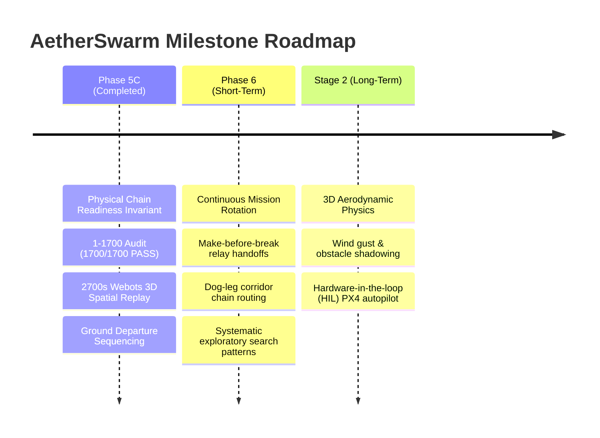

# System Limitations & Technical Roadmap

## 1. Document Purpose & Engineering Transparency

This document provides a transparent, factual accounting of the known architectural and operational limitations of AetherSwarm as of the Phase 5C integration and validation baseline. Identifying these limitations ensures clear engineering boundaries and defines the development roadmap for Phase 6 and Stage 2.

---

## 2. Documented Technical Limitations

### 2.1 Localized Relay Handoff Transit Gap
- **Mechanics**: In the current implementation, when an active relay approaches its preemptive RTH deadline (due to the 1200s flight ceiling or battery threshold), the planner dispatches a replacement airframe from the GCS staging pad and commands the incumbent to RTH in the same simulation tick.
- **Limitation**: The replacement UAV travels at $v_{\max} = 5.0\,\text{m/s}$ and incurs a physical transit delay:
  $$t_{\text{transit}} = \frac{\|\mathbf{p}_{\text{station}} - \mathbf{p}_{\text{gcs}}\|_2}{v_{\max}}$$
  During this transit window, station $k$ is temporarily vacant, opening a potential communication gap for downstream nodes until the replacement arrives. Note that while Phase 5C guarantees physical chain readiness prior to initial task engagement, mid-mission handoffs remain instantaneous-swap dispatches.
- **Planned Mitigation (Phase 6)**: Implement predictive make-before-break overlap scheduling. The replacement is launched $t_{\text{transit}} + t_{\text{margin}}$ seconds *before* the incumbent's RTH deadline, holding the incumbent on station until the replacement physically enters the station radius.

### 2.2 Straight-Line Lateral Corridor Clipping Risk
- **Mechanics**: Intermediate relay stations are calculated via collinear interpolation along the line segment between GCS at $(-75.0, 500.0)$ and the target POI $(x_p, y_p)$:
  $$\mathbf{p}_{\text{station}}(k) = \mathbf{p}_{\text{gcs}} + \frac{k}{K + 1} \cdot (\mathbf{p}_{\text{poi}} - \mathbf{p}_{\text{gcs}})$$
- **Limitation**: The transit corridor is bounded laterally: $y \in [400.0, 600.0]$ for $x \in [-75.0, 0.0]$. For extreme corner POIs situated near the ingress boundary with extreme lateral coordinates (e.g. $(10.0, 50.0)$ or $(10.0, 950.0)$), the direct line segment from $(-75, 500)$ intersects the corridor boundary before entering the arena at $x = 0$. A relay positioned at $x \in [-75, 0]$ with $y < 400$ or $y > 600$ would violate corridor geofencing.
- **Planned Mitigation (Phase 6)**: Implement piece-wise dog-leg chain routing. Waypoints within $x \in [-75, 0]$ are constrained along the corridor centerline $y = 500.0$, transitioning to the direct line-of-sight only after crossing the arena threshold at $(0.0, 500.0)$.

### 2.3 Opportunistic vs. Systematic Hidden POI Search Coverage
- **Mechanics**: Hidden and emerging POIs generated under `--final-profile` are excluded from the initial task allocation and discovered at runtime via altitude-dependent sensor footprint sensing (`compute_detection_radius(z)`: $80.0\,\text{m}$ at $\le 20.0\,\text{m}$ up to $230.0\,\text{m}$ at $\ge 100.0\,\text{m}$ across 5 piecewise linear breakpoints; e.g. $150.0\,\text{m}$ at $50.0\,\text{m}$ cruise).

- **Limitation**: In the current implementation, POI discovery occurs opportunistically along transit corridors traversed while servicing known POIs. In Seed 2026, 2 out of 5 hidden POIs (`hidden_poi_02` and `hidden_poi_04`) were intercepted and fully serviced. The remaining 3 POIs emerged in peripheral arena zones outside active corridors and were not discovered within 2700 ticks.
- **Planned Mitigation (Phase 6)**: Integrate systematic exploratory search trajectories (e.g. Voronoi sector sweeps or lawnmower search paths) for uncommitted or idle airframes during lulls in known-task servicing.

### 2.4 2D Planar Core Simulation Scope
- **Mechanics**: Kinematic integration, velocity limits, obstacle proximity, and RF range evaluations in `src/ares_swarm/` are calculated in 2D horizontal coordinates ($x, y$).
- **Limitation**: Operational altitude ($z \in [0.0, 100.0\,\text{m}]$) is maintained as metadata in configuration and is verified downstream in the Cyberbotics Webots R2025a supervisor, rather than inside the headless Python loop.
- **Context**: This is an intentional design boundary for Stage 1 (deterministic CPU-only simulation). True 3D kinematic trajectories and aerodynamic lift/drag dynamics are planned for Stage 2.

---

## 3. Recently Resolved Limitations (Phase 5C)

1. **Premature Surveyor Sortie**: Previously, surveyors were dispatched concurrently with intermediate relays, entering RF blackouts before relays reached their stations. Resolved via `is_chain_physically_ready(...)` invariant holding the surveyor at staging until upstream relays achieve $\le 5.0\,\text{m}$ station positioning and pass Gamma connectivity checks.
2. **Staging Pad Departure Bunching**: Previously, simultaneous dispatch caused spatial separation violations at $(-75.0, 500.0)$. Resolved via ground departure sequencing with $6.0\,\text{s}$ minimum separation stagger.

---

## 4. Technical Roadmap

The structured milestone roadmap outlines upcoming capabilities through Stage 1 completion and Stage 2 evolution:

```mermaid
timeline
    title AetherSwarm Milestone Roadmap
    Phase 5C (Completed) : Physical Chain Readiness Invariant : 1-1700 Audit (1700/1700 PASS) : 2700s Webots 3D Spatial Replay : Ground Departure Sequencing
    Phase 6 (Short-Term) : Continuous Mission Rotation : Make-before-break relay handoffs : Dog-leg corridor chain routing : Systematic exploratory search patterns
    Stage 2 (Long-Term)  : 3D Aerodynamic Physics : Wind gust & obstacle shadowing : Hardware-in-the-loop (HIL) PX4 autopilot
```

### Phase 6: Continuous Mission Rotation & Advanced Planning (Short-Term)
- **Make-Before-Break Handoffs**: Predictive dispatch of replacement relays to eliminate link transit gaps.
- **Corridor Dog-Leg Geometry**: Safe relay waypoint positioning avoiding lateral corridor boundary clipping.
- **Systematic Search Coverage**: Coordinated exploratory sweep paths for idle airframes to discover peripheral hidden POIs.
- **Multi-Wave Chain Maintenance**: Maintaining persistent communication bridges to distant active POIs while intermediate relays cycle through staggered recharge sorties.

### Stage 2 Evolution (Long-Term Architectural Vision)
- **3D Kinematics & Aerodynamics**: 3D spatial motion, rotor downwash effects, and wind field modeling.
- **RF Shadowing & Multipath**: Topographical terrain elevation maps and physical obstacle link degradation.
- **Hardware-in-the-Loop (HIL)**: Exporting trajectory setpoints to PX4 / ArduPilot autopilots via MAVLink.
