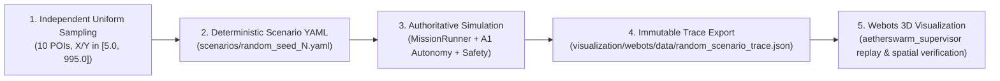

# Randomized POI Working Scenario Generator

> [!NOTE]
> **Authoritative Working Model**
> Webots visualizes the authoritative AetherSwarm working model from an immutable simulation trace.
> - Canonical competition benchmark scenarios (e.g. [`scenarios/poc_round1.yaml`](file:///home/dell/swarm_ws/AetherSwarm/scenarios/poc_round1.yaml)) and the frozen baseline trace ([`visualization/webots/data/e1_authoritative_trace.json`](file:///home/dell/swarm_ws/AetherSwarm/visualization/webots/data/e1_authoritative_trace.json)) remain untouched.
> - Core autonomy, communication routing, and safety enforcement run authoritatively through [`MissionRunner`](file:///home/dell/swarm_ws/AetherSwarm/src/ares_swarm/simulation/runner.py) and [`SimulationEngine`](file:///home/dell/swarm_ws/AetherSwarm/src/ares_swarm/core/simulator.py).

---

## 1. Architectural Overview

To evaluate and demonstrate swarm operations under varied spatial topologies without compromising simulation fidelity, AetherSwarm implements a strict 5-stage pipeline:



### Architectural Principles:
1. **Zero Webots Autonomy / Strictly Immutable Trace Replay**: The Webots supervisor controller is strictly a playback and spatial verification engine. POI positions and spawn times are **never** generated or modified inside Webots.
2. **Authoritative Consistency**: The generated POI positions in the scenario YAML are the ground-truth task targets dispatched by [`A1TaskAllocator`](file:///home/dell/swarm_ws/AetherSwarm/src/ares_swarm/autonomy/a1_allocator.py), navigated to by [`SimulationEngine`](file:///home/dell/swarm_ws/AetherSwarm/src/ares_swarm/core/simulator.py), and safety-checked by [`SeparationEnforcer`](file:///home/dell/swarm_ws/AetherSwarm/src/ares_swarm/safety/separation.py) and [`GeofenceEnforcer`](file:///home/dell/swarm_ws/AetherSwarm/src/ares_swarm/safety/geofence.py).
3. **Dynamic 3D Beacon Placement**: At trace load time, the Webots supervisor queries the authoritative task positions from tick 0 and updates the `translation` fields of the 3D POI target nodes (`POI_01` .. `POI_10`). The physical 3D ground markers precisely match the flight targets.
4. **Deterministic Reproducibility**: Given a seed $S$, the PRNG sequence generates identical POIs, identical priorities, identical spawn times, identical simulation results, and an identical trace bit-for-bit.

---

## 2. POI Sampling & Geometric Placement

POIs are sampled randomly across the configured arena bounds; the generator does not enforce quadrant or regional distribution.

1. **Count**: Exactly 10 POIs (`poi_01` to `poi_10`) by default for the UAV-X scenario.
2. **Operational Arena Containment**:
   - Standard operational arena bounds: $x \in [5.0, 995.0]$, $y \in [5.0, 995.0]$ (configured via `ScenarioGenConfig.x_range` and `y_range`).
   - Boundary margin: configurable (default $0.0$ m; bounds explicitly constrain coordinates within the valid arena).
   - Ingress corridor exclusion: $x \ge 5.0 > 0.0$ guarantees no POI is ever placed in the staging/corridor area ($x \le 0.0$).
3. **Independent Uniform Random Placement**:
   - By default (`min_spacing_m = 0.0`), X and Y coordinates are sampled independently from Uniform(5.0, 995.0).
   - No quadrant balancing, no sector allocation, no grid placement, and no intentional spatial spreading.
   - When minimum spacing is explicitly requested (`min_spacing_m > 0.0`), deterministic seeded rejection sampling enforces that constraint (producing constrained random placement, not independent uniform samples).
4. **Deterministic Ordering**:
   - When multiple POIs have identical spawn times, ties are deterministically resolved by lexicographic task ID sorting (`(t["spawn_time"], t["id"])`).

---

## 3. CLI Usage

The primary scenario generator script is [`scripts/generate_scenario.py`](file:///home/dell/swarm_ws/AetherSwarm/scripts/generate_scenario.py).
*(A backward-compatibility wrapper is also maintained at [`scripts/generate_random_demo.py`](file:///home/dell/swarm_ws/AetherSwarm/scripts/generate_random_demo.py)).*

### Basic Command (Generates YAML, runs simulation, exports trace):
```bash
# In WSL:
.venv/bin/python scripts/generate_scenario.py --seed 2026

# Output:
# Scenario: scenarios/random_seed_2026.yaml
# Trace:    visualization/webots/data/random_scenario_trace.json
# (Backward-compatibility copy also updated: visualization/webots/data/random_demo_trace.json)
```

### CLI Arguments:
| Argument | Type | Default | Description |
|---|---|---|---|
| `--seed` | `int` | `2026` | PRNG seed for deterministic scenario and trace generation |
| `--num-pois` | `int` | `10` | Number of POIs to place (10 default) |
| `--min-spacing` | `float` | `0.0` | Minimum pairwise distance in meters (0.0 = direct independent uniform sampling; >0 enables rejection sampling) |
| `--margin` | `float` | `0.0` | Optional margin from operational arena boundaries in meters |
| `--spawn-start` | `float` | `0.0` | Earliest POI appearance time (seconds) |
| `--spawn-end` | `float` | `300.0` | Latest POI appearance time (seconds) |
| `--full-arena` | `flag` | `False` | Sample across full arena bounds |
| `--output-scenario` | `path` | `scenarios/random_seed_{seed}.yaml` | Destination scenario YAML file |
| `--output-trace` | `path` | `visualization/webots/data/random_scenario_trace.json` | Destination JSON trace file |
| `--max-ticks` | `int` | `None` | Optional tick limit (default: full duration 2700 ticks) |
| `--no-run` | `flag` | `False` | Generate scenario YAML only without running simulation |

---

## 4. Validated Reference Seeds

Reference seeds were generated, executed through the authoritative simulation engine, and validated in the independent Webots spatial verification engine:

### Summary Table

| Metric | Seed 42 | Seed 101 | Seed 2026 |
|---|---|---|---|
| **POIs Generated** | 10 | 10 | 10 |
| **Configured Min Spacing** | 40.0 m | 40.0 m | 40.0 m |
| **Actual Min Spacing** | **78.11 m** | **45.86 m** | **49.95 m** |
| **Average Spacing** | 254.21 m | 214.74 m | 250.97 m |
| **Spatial Bounds (X)** | $[91.30, 392.03]$ | $[87.66, 390.31]$ | $[102.88, 419.88]$ |
| **Spatial Bounds (Y)** | $[234.01, 706.81]$ | $[329.06, 681.10]$ | $[233.85, 715.11]$ |
| **Spawn Window** | $28.1\text{s} - 267.7\text{s}$ | $2.0\text{s} - 277.2\text{s}$ | $72.0\text{s} - 241.5\text{s}$ |
| **Tasks Completed** | **10 / 10 (100%)** | **10 / 10 (100%)** | **10 / 10 (100%)** |
| **Min Separation Observed** | **20.00 m** | **20.00 m** | **20.00 m** |
| **Separation Violations** | **0** | **0** | **0** |
| **Geofence Violations** | **0** | **0** | **0** |
| **Altitude Violations** | **0** | **0** | **0** |
| **Trace Size** | 23.30 MB | 23.25 MB | 26.47 MB |

---

## 5. Webots Visualization Workflow

The Webots supervisor controller [`visualization/webots/controllers/aetherswarm_supervisor/aetherswarm_supervisor.py`](file:///home/dell/swarm_ws/AetherSwarm/visualization/webots/controllers/aetherswarm_supervisor/aetherswarm_supervisor.py) supports several convenient ways to replay the randomized working scenario:

### Method A: Direct Command-Line Execution (Standalone or Webots)
```bash
.venv/bin/python visualization/webots/controllers/aetherswarm_supervisor/aetherswarm_supervisor.py random
# or provide path directly:
.venv/bin/python visualization/webots/controllers/aetherswarm_supervisor/aetherswarm_supervisor.py visualization/webots/data/random_scenario_trace.json
```

### Method B: Environment Variable Selector
Set `AETHERSWARM_SCENARIO` before launching Webots or the supervisor:
```bash
export AETHERSWARM_SCENARIO=random
```

### Method C: Webots Robot customData
In Webots R2025a, open [`visualization/webots/worlds/uavx_round1.wbt`](file:///home/dell/swarm_ws/AetherSwarm/visualization/webots/worlds/uavx_round1.wbt). In the scene tree, select the `AetherSwarmSupervisor` Robot node and set its `customData` field to:
```text
random
```
The supervisor will automatically load `visualization/webots/data/random_scenario_trace.json`, update the 3D POI beacons to match the randomized scenario, and replay the flight paths with full HUD telemetry.
