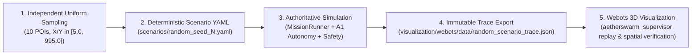

# Randomized POI Working Scenario Generator

> [!NOTE]
> **Authoritative Working Model**
> Webots visualizes the authoritative AetherSwarm working model from an immutable simulation trace.
> - Canonical competition benchmark scenarios (e.g. [`scenarios/poc_round1.yaml`](file:///home/dell/swarm_ws/AetherSwarm/scenarios/poc_round1.yaml)) and the frozen baseline trace ([`visualization/webots/data/e1_authoritative_trace.json`](file:///home/dell/swarm_ws/AetherSwarm/visualization/webots/data/e1_authoritative_trace.json)) remain untouched.
> - Core autonomy, communication routing, and safety enforcement run authoritatively through [`MissionRunner`](file:///home/dell/swarm_ws/AetherSwarm/src/ares_swarm/simulation/runner.py) and [`SimulationEngine`](file:///home/dell/swarm_ws/AetherSwarm/src/ares_swarm/core/simulator.py).

---

## 1. Architectural Overview

To evaluate and demonstrate swarm operations under varied spatial topologies without compromising simulation fidelity, AetherSwarm implements a strict 5-stage pipeline:


```mermaid
flowchart LR
    A["1. Independent Uniform Sampling<br/>(10 POIs, X/Y in [5.0, 995.0])"] --> B["2. Deterministic Scenario YAML<br/>(scenarios/random_seed_N.yaml)"]
    B --> C["3. Authoritative Simulation<br/>(MissionRunner + A1 Autonomy + Safety)"]
    C --> D["4. Immutable Trace Export<br/>(visualization/webots/data/random_scenario_trace.json)"]
    D --> E["5. Webots 3D Visualization<br/>(aetherswarm_supervisor replay & spatial verification)"]
```

### Architectural Principles:
1. **Zero Webots Autonomy / Strictly Immutable Trace Replay**: The Webots supervisor controller is strictly a playback and spatial verification engine. POI positions and spawn times are **never** generated or modified inside Webots.
2. **Authoritative Consistency**: The generated POI positions in the scenario YAML are the ground-truth task targets dispatched by [`A1TaskAllocator`](file:///home/dell/swarm_ws/AetherSwarm/src/ares_swarm/autonomy/a1_allocator.py), navigated to by [`SimulationEngine`](file:///home/dell/swarm_ws/AetherSwarm/src/ares_swarm/core/simulator.py), and safety-checked by [`SeparationEnforcer`](file:///home/dell/swarm_ws/AetherSwarm/src/ares_swarm/safety/separation.py) and [`GeofenceEnforcer`](file:///home/dell/swarm_ws/AetherSwarm/src/ares_swarm/safety/geofence.py).
3. **Dynamic 3D Beacon Placement**: At trace load time, the Webots supervisor queries the authoritative task positions from tick 0 and updates the `translation` fields of the 3D POI target nodes (`POI_01` .. `POI_10`). The physical 3D ground markers precisely match the flight targets.
4. **Deterministic Reproducibility**: Given a seed $S$, the PRNG sequence generates identical POIs, identical priorities, identical spawn times, identical simulation results, and an identical trace bit-for-bit.

---

## 2. POI Sampling & Geometric Placement

POIs are sampled randomly within the configured arena bounds and operational envelope.

1. **Mission Profiles**:
   - **Baseline Mode**: Exactly 10 known POIs (`poi_01` to `poi_10`).
   - **Final Profile Mode (`--final-profile`)**: Exactly 5 known POIs + 5–7 emerging hidden POIs (10–12 total). In seed 2026, generates exactly 5 known and 5 hidden POIs.
2. **Operational Arena Containment & 800 m Circular Radius Constraint**:
   - Standard operational arena bounds: $x \in [5.0, 995.0]$, $y \in [5.0, 995.0]$.
   - Circular radius constraint: all generated known and hidden POIs must satisfy:
     $$\sqrt{(x + 75.0)^2 + (y - 500.0)^2} \le 800.0\,\text{m}$$
     centered at the operational drone/GCS center $(-75.0, 500.0)$.
   - Rejection sampling enforces this condition during candidate generation; candidates violating the 800 m radius are immediately resampled until the exact required count is satisfied.
   - Ingress corridor exclusion: $x \ge 5.0 > 0.0$ guarantees no POI is ever placed in the staging/corridor area ($x \le 0.0$).
3. **Hidden / Emerging POI Dynamics**:
   - Hidden POIs have defined emergence times ($t_{\text{emerge}} \in [0.0, 300.0]\,\text{s}$).
   - **Logical Planner State**: Hidden POIs are strictly excluded from the initial planner snapshot at $T_0$.
   - **Physical Detection**: An active UAV must physically detect the emerged target via altitude-scaled sensor FOV via `compute_detection_radius(z)` ($80.0\,\text{m}$ at $z \le 20.0\,\text{m}$, $150.0\,\text{m}$ at $z = 50.0\,\text{m}$, $230.0\,\text{m}$ at $z \ge 100.0\,\text{m}$).
   - **Discovery Pipeline**: Physical detection emits `POI_DISCOVERED`, dispatching `DiscoverTaskCommand`, which creates a standard `TaskState` with `status = PENDING`. The task is then allocated normally via `A1TaskAllocator` / `ConnectivityAwarePlanner`.
   - **Webots Visual Model**: To provide continuous physical scene inspection without leaking logical state, Webots maps hidden POIs to ground target nodes (`POI_06`..`POI_10`) at $T_0$ with dormant violet indicators, transitioning to gold on discovery, cyan when in progress, and emerald green upon completion.

---

## 3. CLI Usage

The primary scenario generator script is [`scripts/generate_scenario.py`](../scripts/generate_scenario.py):

### Basic Generation Commands:
```bash
# Generate final-profile mission (5 known + 5..7 hidden POIs, 800m circular constraint)
python scripts/generate_scenario.py \
  --seed 2026 \
  --final-profile \
  --max-ticks 2700 \
  --output-scenario scenarios/random_seed_2026.yaml \
  --output-trace visualization/webots/data/random_scenario_trace.json

# Generate YAML only without simulation execution
python scripts/generate_scenario.py \
  --seed 2026 \
  --final-profile \
  --no-run \
  --output-scenario scenarios/random_seed_2026.yaml
```

### CLI Arguments:
| Argument | Type | Default | Description |
|---|---|---|---|
| `--seed` | `int` | `2026` | PRNG seed for deterministic scenario and trace generation |
| `--num-pois` | `int` | `10` | Number of known POIs (or 5 when `--final-profile` is set) |
| `--num-hidden-pois` | `int` | `0` | Number of hidden POIs (or 5–7 when `--final-profile` is set) |
| `--final-profile` | `flag` | `False` | Generate final profile: 5 known + 5–7 emerging hidden POIs |
| `--max-radius` | `float` | `800.0` | Maximum radius from $(-75.0, 500.0)$ in meters (default: 800.0) |
| `--min-spacing` | `float` | `0.0` | Minimum pairwise distance in meters (0.0 = direct independent uniform sampling; >0 enables rejection sampling) |
| `--margin` | `float` | `0.0` | Optional margin from operational arena boundaries in meters |
| `--spawn-start` | `float` | `0.0` | Earliest POI appearance time (seconds) |
| `--spawn-end` | `float` | `300.0` | Latest POI appearance time (seconds) |
| `--emergence-start` | `float` | `0.0` | Earliest hidden POI emergence time (seconds) |
| `--emergence-end` | `float` | `300.0` | Latest hidden POI emergence time (seconds) |
| `--output-scenario` | `path` | `scenarios/random_seed_{seed}.yaml` | Destination scenario YAML file |
| `--output-trace` | `path` | `visualization/webots/data/random_scenario_trace.json` | Destination JSON trace file |
| `--max-ticks` | `int` | `2700` | Simulation tick horizon (default: 2700) |
| `--no-run` | `flag` | `False` | Generate scenario YAML only without running simulation |

---

## 4. Validated Reference Seeds

Reference seeds were generated, executed through the authoritative simulation engine, and validated in the independent Webots spatial verification engine:

### Summary Table

| Metric | Seed 42 | Seed 101 | Seed 2026 |
|---|---|---|---|
| **POIs Generated** | 10 | 10 | 10 |
| **Configured Min Spacing** | 40.0 m | 40.0 m | 40.0 m |
| **Actual Min Spacing** | **78.11 m** | **45.86 m** | **49.95 m** |
| **Average Spacing** | 254.21 m | 214.74 m | 250.97 m |
| **Spatial Bounds (X)** | $[91.30, 392.03]$ | $[87.66, 390.31]$ | $[102.88, 419.88]$ |
| **Spatial Bounds (Y)** | $[234.01, 706.81]$ | $[329.06, 681.10]$ | $[233.85, 715.11]$ |
| **Spawn Window** | $28.1\text{s} - 267.7\text{s}$ | $2.0\text{s} - 277.2\text{s}$ | $72.0\text{s} - 241.5\text{s}$ |
| **Tasks Completed** | **10 / 10 (100%)** | **10 / 10 (100%)** | **10 / 10 (100%)** |
| **Min Separation Observed** | **20.00 m** | **20.00 m** | **20.00 m** |
| **Separation Violations** | **0** | **0** | **0** |
| **Geofence Violations** | **0** | **0** | **0** |
| **Altitude Violations** | **0** | **0** | **0** |
| **Trace Size** | 23.30 MB | 23.25 MB | 26.47 MB |

---

## 5. Webots Visualization Workflow

The Webots supervisor controller [`visualization/webots/controllers/aetherswarm_supervisor/aetherswarm_supervisor.py`](file:///home/dell/swarm_ws/AetherSwarm/visualization/webots/controllers/aetherswarm_supervisor/aetherswarm_supervisor.py) supports several convenient ways to replay the randomized working scenario:

### Method A: Direct Command-Line Execution (Standalone or Webots)
```bash
.venv/bin/python visualization/webots/controllers/aetherswarm_supervisor/aetherswarm_supervisor.py random
# or provide path directly:
.venv/bin/python visualization/webots/controllers/aetherswarm_supervisor/aetherswarm_supervisor.py visualization/webots/data/random_scenario_trace.json
```

### Method B: Environment Variable Selector
Set `AETHERSWARM_SCENARIO` before launching Webots or the supervisor:
```bash
export AETHERSWARM_SCENARIO=random
```

### Method C: Webots Robot customData
In Webots R2025a, open [`visualization/webots/worlds/uavx_round1.wbt`](file:///home/dell/swarm_ws/AetherSwarm/visualization/webots/worlds/uavx_round1.wbt). In the scene tree, select the `AetherSwarmSupervisor` Robot node and set its `customData` field to:
```text
random
```
The supervisor will automatically load `visualization/webots/data/random_scenario_trace.json`, update the 3D POI beacons to match the randomized scenario, and replay the flight paths with full HUD telemetry.

### Method D: Canonical PowerShell Launcher (Windows Host)
From Windows PowerShell, execute:
```powershell
.\scripts\launch_random_webots.ps1 -Seed 2026
```
The launcher handles Windows/WSL path mapping, detecting mapped drive `Z:` or resolving paths via `.ProviderPath` to ensure clean Windows path syntax without PowerShell provider prefixes.
