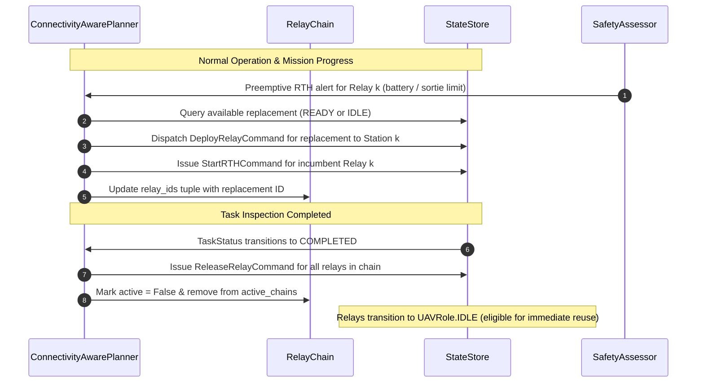

# Multi-Hop Relay & Chain Coordination Architecture

## 1. Overview & Objective

In large-scale disaster arenas ($1000\,\text{m} \times 1000\,\text{m}$), points of interest (POIs) can be situated up to $\approx 1185\,\text{m}$ from the Ground Control Station (GCS) at $(-75.0, 500.0)$. With a physical radio transmission limit of $R_{\text{comm}} = 100.0\,\text{m}$, direct communication between GCS and distant survey aircraft is physically impossible.

Commit `342775b` implements the **Phase 5B Multi-Hop Relay Architecture**, introducing dynamic, collinear relay chains managed by [`ConnectivityAwarePlanner`](file:///home/dell/swarm_ws/AetherSwarm/src/ares_swarm/autonomy/connectivity_planner.py) and encapsulated in [`RelayChain`](file:///home/dell/swarm_ws/AetherSwarm/src/ares_swarm/autonomy/connectivity_planner.py). This architecture provides the geometric algorithms to establish end-to-end multi-hop RF packet routes from distant POIs to the GCS, satisfying the mandatory $10.0\,\text{s}$ detection-to-reporting deadline.

> [!NOTE]
> **Geometric Capability vs. Operational Validation**:
> Phase 5B implements and deterministically tests the multi-hop chain mechanics. Geometric capability to formulate chains up to $D \approx 1185.6\,\text{m}$ ($K_{\min} \le 12$) does not imply complete operational coverage under all randomized distributions and fleet sizes. Full-arena randomized operational validation is the specific objective of Phase 5C.

---

## 2. Geometric Formulation & Lower Bounds

```
 GCS [-75, 500]                                                                       Target POI
   (•)════════════(•)════════════(•)══════════════ ... ════════════(•)═══════════════════[★]
         Hop 1         Hop 2         Hop 3                    Hop H_min       Surveyor
        <= 95m        <= 95m        <= 95m                     <= 95m
      Station 1     Station 2     Station 3                  Station K
```

### 2.1 Effective Planning Range ($R_{\text{eff}}$)
To ensure robust link margins against kinematic position tracking lag and discretization effects, the planner operates on a conservative effective range:
- Physical RF cut-off: $R_{\text{comm}} = 100.0\,\text{m}$
- Planning link margin: $5\%$ ($5.0\,\text{m}$)
- Effective planning range:
  $$R_{\text{eff}} = 100.0\,\text{m} \times 0.95 = 95.0\,\text{m}$$

### 2.2 Hop and Relay Bounds
For a target POI at 2D coordinate $\mathbf{p}_{\text{poi}} = (x_p, y_p)$ relative to GCS at $\mathbf{p}_{\text{gcs}} = (-75.0, 500.0)$:
- Total Euclidean distance:
  $$D = \|\mathbf{p}_{\text{poi}} - \mathbf{p}_{\text{gcs}}\|_2 = \sqrt{(x_p - (-75.0))^2 + (y_p - 500.0)^2}$$
- Minimum required communication hops:
  $$H_{\min} = \left\lceil \frac{D}{R_{\text{eff}}} \right\rceil = \left\lceil \frac{D}{95.0} \right\rceil$$
- Minimum required intermediate relays:
  $$K_{\min} = \max(0, H_{\min} - 1)$$

> [!IMPORTANT]
> **Geometric Lower Bound Distinction**:
> $K_{\min}$ is strictly a **geometric lower bound**, representing the absolute minimum number of intermediate relays required to span the distance in a straight line under ideal placement. The actual operational fleet size required across a 45-minute mission is substantially higher due to finite battery capacities, 20-minute sortie rotations, and staggered transit times.

### 2.3 Arena Distance Envelope Examples

| Scenario / Target Region | Target Coordinates | Distance from GCS ($D$) | Min Hops ($H_{\min}$) | Min Relays ($K_{\min}$) | Total Chain Assets ($1 + K_{\min}$) |
| :--- | :---: | :---: | :---: | :---: | :---: |
| **GCS Immediate Perimeter** | $(10.0, 500.0)$ | $85.0\,\text{m}$ | $1$ | $0$ (Direct) | $1$ surveyor |
| **Single-Relay Envelope** | $(110.0, 500.0)$ | $185.0\,\text{m}$ | $2$ | $1$ relay | $2$ UAVs |
| **Arena Center** | $(500.0, 500.0)$ | $575.0\,\text{m}$ | $7$ | $6$ relays | $7$ UAVs |
| **Near Corner** | $(0.0, 0.0)$ | $505.6\,\text{m}$ | $6$ | $5$ relays | $6$ UAVs |
| **Far East Center** | $(1000.0, 500.0)$ | $1075.0\,\text{m}$ | $12$ | $11$ relays | $12$ UAVs |
| **Farthest Arena Corner** | $(1000.0, 1000.0)$ | $1185.6\,\text{m}$ | $13$ | $12$ relays | $13$ UAVs |

---

## 3. Station Positioning Geometry

When deploying $K$ intermediate relays for a chain, the planner spaces the intermediate waypoints uniformly along the straight line connecting $\mathbf{p}_{\text{gcs}}$ and $\mathbf{p}_{\text{poi}}$:

$$\mathbf{p}_{\text{station}}(k) = \mathbf{p}_{\text{gcs}} + \frac{k}{K + 1} \cdot (\mathbf{p}_{\text{poi}} - \mathbf{p}_{\text{gcs}}), \quad k \in \{1, 2, \dots, K\}$$

The distance between consecutive stations satisfies:
$$\Delta d = \|\mathbf{p}_{\text{station}}(k) - \mathbf{p}_{\text{station}}(k-1)\|_2 = \frac{D}{K + 1} \le R_{\text{eff}} = 95.0\,\text{m}$$

Stations are indexed sequentially from the GCS outward:
- $\mathbf{p}_{\text{station}}(1)$: Closest relay to GCS ($d \le 95.0\,\text{m}$ from $\mathbf{p}_{\text{gcs}}$).
- $\mathbf{p}_{\text{station}}(K)$: Outermost relay ($d \le 95.0\,\text{m}$ from $\mathbf{p}_{\text{poi}}$).

---

## 4. RelayChain Lifecycle & State Representation

Active chains are tracked in memory via the typed [`RelayChain`](file:///home/dell/swarm_ws/AetherSwarm/src/ares_swarm/autonomy/connectivity_planner.py) dataclass:

```python
@dataclass
class RelayChain:
    task_id: str
    surveyor_id: str
    relay_ids: tuple[str, ...]
    stations: tuple[Vector2D, ...]
    target_position: Vector2D
    active: bool = True
    created_at: float = 0.0
```

### 4.1 Atomic Deployment Contract
To prevent partial fleet commitments and stranded airframes:
1. When evaluating a POI requiring $K_{\min}$ relays, the planner queries for available candidates:
   - UAVs in `SortieState.READY` at the GCS staging pad.
   - Airborne UAVs in `SortieState.ACTIVE` with role `UAVRole.IDLE`.
   - Existing relays eligible for reassignment.
2. If total available eligible candidates $N_{\text{available}} < 1 + K_{\min}$ (1 surveyor + $K_{\min}$ relays):
   - **Atomic Rejection**: No UAVs are commanded.
   - Zero relays are deployed.
   - The task is marked `TASK_DEFERRED` and re-evaluated on subsequent ticks.
   - Available UAVs remain free to service nearer tasks with smaller chain requirements.
3. If $N_{\text{available}} \ge 1 + K_{\min}$:
   - 1 UAV is selected as surveyor and dispatched to $\mathbf{p}_{\text{poi}}$.
   - $K_{\min}$ UAVs are selected as relays, mapped to stations $\mathbf{p}_{\text{station}}(k)$, set to `UAVRole.RELAY`, and dispatched.
   - The `RelayChain` is registered in `planner.active_chains`.

### 4.2 Candidate Selection & Sorting Order
Candidate vehicles are assigned to stations based on proximity and role economy:
1. **Airborne Preference**: Already-airborne idle UAVs are prioritized for intermediate stations over grounded UAVs to minimize transit climb-out time.
2. **Proximity Matching**: For station $k$, candidate UAVs are evaluated by Euclidean distance to $\mathbf{p}_{\text{station}}(k)$.
3. **Deterministic Tie-Breaking**: When candidate travel distances match within epsilon, vehicles are sorted by battery state-of-charge descending, followed by `uav.id` string ascending.

---

## 5. Dynamic Chain Operations: Reuse, Handoff & Teardown



### 5.1 Airborne Relay Reuse
When a task finishes or a chain is decommissioned:
- The assigned relays are not forced to fly back to GCS if they possess sufficient battery and sortie time.
- Their role reverts to `UAVRole.IDLE` while remaining airborne.
- If a subsequent task requires relays at nearby coordinates, these airborne UAVs are retargeted immediately, saving round-trip flight energy.

### 5.2 Localized Link Handoff
When an active relay vehicle approaches its preemptive RTH deadline (due to the 1200s sortie limit or battery threshold):
1. The planner identifies the specific relay node $k$ needing replacement.
2. An available standby or newly recharged UAV is selected from GCS.
3. The replacement vehicle is dispatched to $\mathbf{p}_{\text{station}}(k)$.
4. The incumbent vehicle is transitioned to `StartRTHCommand` and returns to GCS.
5. `RelayChain.relay_ids` is atomically updated with the new vehicle ID.

### 5.3 Localized Hardware Failure Recovery
If an active relay suffers an uncommanded motor or avionics failure (`FailureStatus.FAILED`):
1. `MissionRunner` flags the broken chain topology.
2. `ConnectivityAwarePlanner` attempts localized recovery by dispatching an idle UAV to the failed station coordinate.
3. If no replacement candidate exists:
   - The chain is cleanly torn down.
   - The surveyor and remaining relays are released to `IDLE` or commanded to RTH.
   - The target POI is marked `TASK_DEFERRED`, preserving its accumulated loiter progress.

### 5.4 Clean Chain Teardown
Upon task completion:
- `ReleaseRelayCommand` is issued for every relay in the chain.
- Vehicle roles are reset to `UAVRole.IDLE`.
- The `RelayChain` is marked inactive and pruned from the planner registry.

---

## 6. Authoritative Multi-Hop Performance Metrics

Phase 5B instruments 5 dedicated metrics in [`MissionMetricsReport`](file:///home/dell/swarm_ws/AetherSwarm/src/ares_swarm/evaluation/metrics.py):

| Metric Name | Type | Description |
| :--- | :---: | :--- |
| `multihop_chains_formed` | `int` | Total count of multi-hop relay chains successfully deployed during the mission. |
| `relays_deployed_multihop` | `int` | Cumulative count of individual relay UAV deployments across all multi-hop chains. |
| `relay_handoffs_multihop` | `int` | Number of localized in-flight relay replacements executed without chain teardown. |
| `max_chain_hops` | `int` | Highest hop count observed across any deployed chain ($H \ge 2$). |
| `multihop_deploy_failures` | `int` | Count of task deferrals caused by insufficient available relays ($N_{\text{available}} < 1 + K_{\min}$). |

---

## 7. Known Architectural Caveats & Limitations

1. **Localized Handoff Transit Gap**:
   In the current Phase 5B implementation, when an incumbent relay triggers RTH, it is released in the same tick that the ground replacement is dispatched from GCS. Because the replacement requires transit time ($t_{\text{transit}} = d / v_{\max}$) to reach the station, a temporary communication gap can occur on that link. True overlap make-before-break (where the incumbent remains on station until the replacement physically arrives) is slated for Phase 6.
2. **Straight-Line Lateral Corridor Clipping Risk**:
   Stations are calculated along the direct vector from GCS $(-75, 500)$ to POI $(x_p, y_p)$. For extreme corner POIs situated near the boundary ($y < 400$ or $y > 600$ at $x \approx 0$), the straight line connecting GCS to POI can clip outside the lateral transit corridor ($y \in [400, 600]$ for $x \in [-75, 0]$). Waypoint dog-leg routing is documented in [`LIMITATIONS_AND_ROADMAP.md`](LIMITATIONS_AND_ROADMAP.md).
