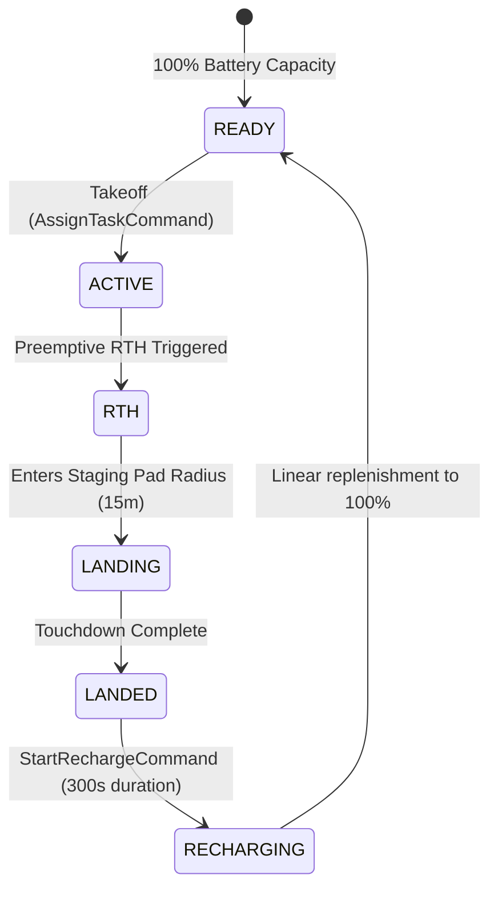

# Safety, Endurance & Return-to-Home (RTH) Architecture

## 1. Overview & Core Safety Invariants

Operating autonomous multi-UAV swarms in shared airspace requires deterministic physical safety guarantees. In AetherSwarm, safety is not an advisory recommendation; it is an active, blocking enforcement layer embedded in [`ares_swarm/safety/`](file:///home/dell/swarm_ws/AetherSwarm/src/ares_swarm/safety/).

> [!IMPORTANT]
> **Core 2D Planar Simulation vs. Webots Downstream 3D Auditing**:
> The authoritative core simulator (`src/ares_swarm/`) models **2D planar kinematics** at constant altitude. Pairwise separation ($\Delta r_{\text{2D}} \ge 20.0\,\text{m}$) and composite geofence corridors are calculated in the horizontal $(x, y)$ plane. The $100.0\,\text{m}$ altitude ceiling is maintained as metadata and audited independently in the downstream Cyberbotics Webots 3D robotics supervisor. The core simulator is a deterministic kinematic scheduling simulator, not a 3D aerodynamic flight dynamics engine.

Every simulation step enforces three foundational safety invariants:
1. **Continuous Inter-UAV Separation**: Pairwise distance between any two airborne UAVs must satisfy $\Delta r \ge 20.0\,\text{m}$ continuously throughout each $1.0\,\text{s}$ movement step.
2. **Composite Airspace Geofencing**: Aircraft must strictly remain within authorized operational zones (Staging Pad, Ingress/Egress Corridor, or Operational Arena) based on their active flight phase.
3. **Continuous Sortie & Battery Bounds**: Continuous airborne duration must not exceed $1200.0\,\text{s}$ (20 minutes), and energy must remain sufficient to guarantee safe transit back to the Ground Control Station (GCS).

---

## 2. 20-Meter Continuous Separation Enforcement

Airborne collision avoidance is enforced by [`SeparationEnforcer`](file:///home/dell/swarm_ws/AetherSwarm/src/ares_swarm/safety/separation_enforcer.py).

```
   [ UAV A ] ════════════════════════════════════════════► Candidate Step
             \                                          /
              \      Inter-UAV Distance >= 20.0m       /
               \    (Continuously verified by bisection)
                ▼                                      ▼
   [ UAV B ] ════════════════════════════════════════════► Candidate Step
```

### 2.1 Spatial Grid Partitioning
Evaluating all pairwise distances across $N$ aircraft incurs $O(N^2)$ complexity. To optimize CPU execution:
- The 2D operational space is partitioned into uniform grid cells of size $w = 20.0\,\text{m}$.
- Active UAVs are hashed into grid buckets in $O(N)$ time.
- Pairwise proximity checks are restricted to adjacent cells ($3 \times 3$ neighborhood), reducing candidate pair checks to $O(N)$ under normal swarm spatial distributions.

### 2.2 Continuous Analytical Bisection
A discrete endpoint check ($\|\mathbf{p}_A(t+1) - \mathbf{p}_B(t+1)\| \ge 20\,\text{m}$) is insufficient: aircraft trajectories can sweep past each other within the $1.0\,\text{s}$ interval and violate separation mid-step.
- The enforcer samples the continuous trajectory parameter $\alpha \in [0.0, 1.0]$:
  $$\mathbf{p}_i(\alpha) = \mathbf{p}_i(t) + \alpha \cdot \mathbf{v}_i \cdot \Delta t$$
- The pairwise distance function $D(\alpha) = \|\mathbf{p}_A(\alpha) - \mathbf{p}_B(\alpha)\|_2$ is analytically evaluated for its global minimum over $\alpha \in [0, 1]$.
- If $\min_{\alpha \in [0, 1]} D(\alpha) < 20.0\,\text{m}$, the candidate step is modified via iterative bisection, decelerating or halting trailing aircraft to guarantee strict separation.

### 2.3 Staging Pad & Landed Exemption
Aircraft that have completed touchdown (`SortieState.LANDED` or `SortieState.RECHARGING`) at the GCS staging pad are powered down on the ground. They are exempted from airborne separation checks, allowing successive returning UAVs to enter the pad boundary without being artificially blocked.

---

## 3. Composite Airspace Geofence Model

The flight boundary is modeled by [`ChallengeAirspace`](file:///home/dell/swarm_ws/AetherSwarm/src/ares_swarm/safety/airspace.py) as three connected geometric zones:

```
  LONGITUDE (X in meters)
 -75m                0m                                            1000m
  ┌──────────────────┬──────────────────────────────────────────────┐ 1000m
  │                  │                                              │
  │                  │                                              │
  │                  │                                              │
  │  TRANSIT         │                                              │
  │  CORRIDOR        │             OPERATIONAL ARENA                │
  │  y in [400, 600] │             x in [0, 1000]                   │
  │  x in [-75, 0]   │             y in [0, 1000]                   │
  ├──────┐           │                                              │
  │ GCS  │           │                                              │
  │ PAD  │           │                                              │
  │ R=15m│           │                                              │
  └──────┴───────────┼──────────────────────────────────────────────┘ 0m
 -75m                0m                                            1000m
```

### 3.1 Zone Specifications
1. **Zone 1: Staging Pad**:
   - Center: $\mathbf{p}_{\text{gcs}} = (-75.0, 500.0)$, Radius: $R_{\text{pad}} = 15.0\,\text{m}$.
   - Function: Parking, ground power recharge, launch, and landing touchdown.
2. **Zone 2: Transit Corridor**:
   - Bounds: $x \in [-75.0, 0.0]$, $y \in [400.0, 600.0]$.
   - Function: Dedicated bidirectional transit channel linking GCS staging pad to the arena boundary ($x = 0$).
3. **Zone 3: Operational Arena**:
   - Bounds: $x \in [0.0, 1000.0]$, $y \in [0.0, 1000.0]$.
   - Function: Active search, relay positioning, and POI task inspection volume.

### 3.2 State-Dependent Flight Phase Rules
A UAV position $\mathbf{p} = (x, y)$ is evaluated against its current [`FlightPhase`](file:///home/dell/swarm_ws/AetherSwarm/src/ares_swarm/safety/airspace.py):
- `STAGING`: Position must reside within $R_{\text{pad}} \le 15.0\,\text{m}$.
- `INGRESS`: Position must reside within `TransitCorridor`, `StagingPad`, or the entry boundary of `OperationalArena`.
- `MISSION`: Position must reside strictly inside `OperationalArena` ($[0, 1000] \times [0, 1000]$).
- `EGRESS`: Position must reside in `OperationalArena` or `TransitCorridor` heading toward $\mathbf{p}_{\text{gcs}}$.
- `LANDED`: Position must be stationary within $R_{\text{pad}} \le 15.0\,\text{m}$ of $\mathbf{p}_{\text{gcs}}$.

---

## 4. 20-Minute Sortie Ceiling & Preemptive RTH

The UAV-X Challenge establishes a hard airborne endurance limit:
> *"UAV maximum flight time = 20 min = 1200 s"*

To prevent airborne battery exhaustions and enforce safe touchdown before the 1200-second mark, [`SafetyAssessor`](file:///home/dell/swarm_ws/AetherSwarm/src/ares_swarm/safety/safety_assessor.py) continuously calculates flight time budgets.

### 4.1 Preemptive Return Calculation
At every simulation tick, for each airborne UAV:
1. Active sortie duration is calculated:
   $$\tau_{\text{sortie}} = t_{\text{sim}} - t_{\text{takeoff}}$$
2. Remaining available airborne time is:
   $$\tau_{\text{remain}} = 1200.0\,\text{s} - \tau_{\text{sortie}}$$
3. Required return transit time to GCS staging pad is computed:
   $$t_{\text{rth\_required}} = \frac{\|\mathbf{p}_{\text{uav}} - \mathbf{p}_{\text{gcs}}\|_2}{v_{\max}} + t_{\text{margin}} + t_{\text{stagger}}$$
   Where:
   - $v_{\max} = 5.0\,\text{m/s}$ (speed limit)
   - $t_{\text{margin}} = 15.0\,\text{s}$ (safety reserve)
   - $t_{\text{stagger}} = \text{uav\_index} \times 8.0\,\text{s}$ (stagger offset preventing landing deadlocks)
4. **Trigger Condition**:
   $$\tau_{\text{remain}} \le t_{\text{rth\_required}} \implies \text{Dispatch StartRTHCommand}$$

Any aircraft reaching this threshold aborts its active task, transitions to `SortieState.RTH`, and immediately heads for GCS.

---

## 5. Battery Discharge & Ground Recharge Lifecycle

Energy dynamics are tracked by [`BatteryModel`](file:///home/dell/swarm_ws/AetherSwarm/src/ares_swarm/energy/battery.py).



### 5.1 Discharge Model
Energy consumption during flight is modeled as:
- **Hover Power**: $P_{\text{hover}} \approx 180.0\,\text{W}$.
- **Transit Power**: $P_{\text{transit}}(v) \approx 180.0\,\text{W} + k_v \cdot v^2$.
- Battery capacity is parameterized in Watt-hours ($E_{\text{cap}} = 120.0\,\text{Wh}$).

### 5.2 Ground Recharge Lifecycle
1. Touchdown at the staging pad triggers `CompleteRTHCommand` followed immediately by `StartRechargeCommand`.
2. The vehicle enters `SortieState.RECHARGING`, capturing $t_{\text{recharge\_start}} = t_{\text{sim}}$.
3. Battery charge replenishes linearly over the configured duration:
   `recharge_duration_s = 300.0` ($5.0$ minutes).
4. At $t_{\text{sim}} \ge t_{\text{recharge\_start}} + 300.0\,\text{s}$, `CompleteRechargeCommand` is dispatched:
   - Battery state-of-charge is restored to $100.0\%$.
   - Vehicle transitions to `SortieState.READY`.
   - Sortie clocks are reset (`is_airborne = False`, `current_sortie_duration_s = 0.0`).
   - The vehicle becomes immediately eligible for redeployment.

---

## 6. Resolution of Multi-UAV Landing Deadlocks

### 6.1 The 2700s Mission Freeze Problem
During early integration runs, missions spanning $> 1200\,\text{s}$ experienced terminal deadlocks where multiple returning UAVs halted at approximately $20\,\text{m}$ separation outside the GCS staging pad:
1. **Lateral V-Cone Pinch**: Simultaneous RTH triggers caused multiple aircraft to converge simultaneously on the single GCS point $(-75, 500)$. As they entered the corridor $x \in [-75, 0]$, lateral separation shrank below $20\,\text{m}$, freezing trailing aircraft.
2. **Numerical Bisection Lock**: In `SeparationEnforcer`, a conservative threshold buffer ($20.005\,\text{m}$) caused stationary holding aircraft to fail numerical bisection due to floating-point epsilon jitter, freezing both aircraft indefinitely.
3. **Rigid Ground Obstacles**: Landed vehicles parked on the pad were treated as active airborne collision hazards, preventing trailing vehicles from completing touchdown.

### 6.2 The Three-Part Solution
Phase 2 resolved this deadlock completely:
1. **Deterministic Arrival Stagger**: `SafetyAssessor` applies an offset $t_{\text{stagger}} = \text{uav\_index} \times 8.0\,\text{s}$ to RTH triggers, staggering returns in an in-trail queue.
2. **Dynamic Separation Tolerance**: `SeparationEnforcer` adapts the threshold buffer when aircraft are already at the $20.0\,\text{m}$ boundary, preventing false numerical bisection freezes.
3. **Landed Pad Exemption**: Vehicles in `LANDED` or `RECHARGING` states on the staging pad are excluded from airborne separation enforcement.
