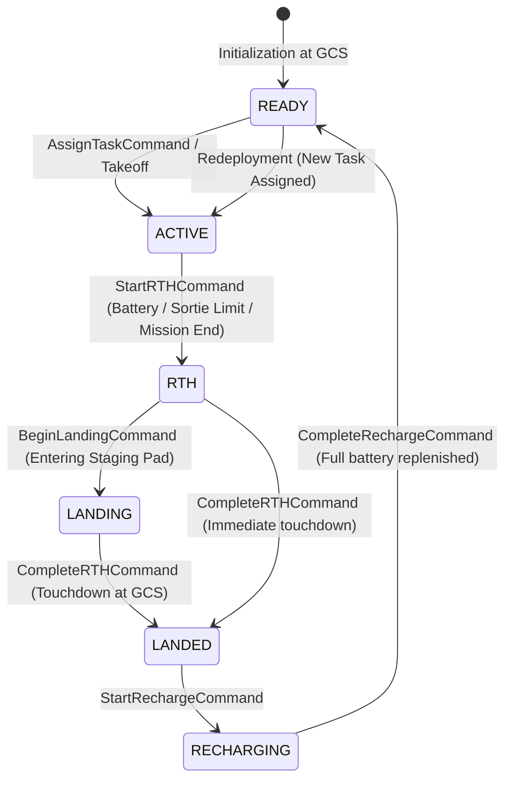

# AetherSwarm Sortie Rotation and Handoff Architecture (V1)

## 1. Executive Summary & Problem Statement

In the UAV-X Stage 1 mission framework, long-duration swarm missions (e.g. 2700 s / 45 min) operate under a strict **1200 s (20-minute) maximum continuous airborne sortie duration limit** per UAV. In previous iterations, swarms operated either on single continuous flights or suffered from endurance violations and terminal arrival deadlocks.

Phase 2 establishes the **authoritative V1 Sortie Lifecycle Architecture**:
1. **Explicit Sortie State Machine**: `READY`, `ACTIVE`, `RTH`, `LANDING`, `LANDED`, and `RECHARGING`.
2. **Preemptive Sortie Limit Enforcement**: Deterministic RTH triggers ensure all UAVs return and land at the GCS staging pad strictly prior to the 1200 s limit.
3. **Task Continuity & Handoff**: Servicing UAVs returning for RTH release in-progress tasks back to the allocation queue (`TASK_HANDOFF` and `TASK_DEFERRED`), preserving task progress for reassignment.
4. **Deterministic Recharge Lifecycle**: Configurable ground recharge duration (`recharge_duration_s`), linear battery replenishment, transition to `READY`, and clean redeployment for subsequent sorties.
5. **Multi-UAV Landing Deadlock Resolution**: Fixed the 2700 s freeze where multiple returning UAVs halted at 20 m separation outside the GCS staging pad.

---

## 2. Root-Cause Analysis: The 2700 s Multi-UAV Landing Deadlock

Prior to Phase 2, when multiple UAVs attempted to return simultaneously to the GCS staging pad `(-75.0, 500.0)`, they became permanently halted at approximately 20 m separation until the 2700 s mission timeout expired.

### 2.1 Technical Root Causes

1. **Numerical Bisection Freeze in `SeparationEnforcer`**:
   - The separation enforcer configured `safe_dist_threshold = min_separation_m + 0.005 = 20.005 m`.
   - When two UAVs arrived near the GCS from different lateral trajectories ($y \approx 480$ and $y \approx 520$) converging on $(-75, 500)$, their pairwise distance dropped to $20.0050 \text{ m}$.
   - At this boundary, candidate trajectories with $\alpha = 0$ (stationary hold) yielded continuous separation evaluating slightly below $20.005 \text{ m}$ due to floating-point representation, causing the bisection search to reject all motion and force $\alpha = 0.0$ indefinitely. Both UAVs locked into mutual freeze.

2. **Simultaneous Lateral Convergence (The V-Cone Pinch)**:
   - When multiple UAVs triggered RTH at the exact same tick (e.g. at mission end $t = 2700 - \Delta t$ or simultaneous battery threshold), all active UAVs flew towards the identical single-point GCS coordinate $(-75, 500)$.
   - As they converged laterally within the narrow corridor $x \in [-75, 0]$, inter-UAV separation shrank below $20 \text{ m}$, causing the separation enforcer to halt trailing aircraft while treating leading aircraft as moving obstacles.

3. **Staging Pad Exemption Absence**:
   - UAVs that reached the GCS staging pad and landed were initially still treated as rigid airborne obstacles by trailing UAVs attempting to land on the same pad, preventing trailing vehicles from clearing the corridor threshold.

### 2.2 The V1 Deterministic Solution

1. **Dynamic Separation Tolerance**: In `SeparationEnforcer.is_trajectory_safe`, when initial inter-UAV distance is already within numerical precision of `min_separation_m`, the check enforces `pair_thresh = min_separation_m` rather than the conservative $20.005\text{ m}$ buffer, preventing artificial deadlock locks.
2. **Deterministic Sortie & RTH Stagger**: In `SafetyAssessor.evaluate_rth_triggers`, a deterministic return stagger offset ($t_{\text{stagger}} = \text{uav\_index} \times 8.0 \text{ s}$) is integrated into RTH evaluation. UAVs sequence their arrival in-trail rather than pinching laterally in a converging cone.
3. **Staged & Landed Pad Exemption**: UAVs parked or landed on the staging pad (`SortieState.LANDED`, `SortieState.RECHARGING`, or inactive) are exempt from in-flight airborne separation checks, allowing sequential arrivals to complete touchdown cleanly.

---

## 3. UAV Sortie State Machine

Each UAV in the swarm possesses an explicit `SortieState` tracked in `UAVState` and managed by the deterministic `StateStore`:

### State Definitions & Invariants

| State | Physical Meaning | Airspace Authority | Allocator Eligibility |
| :--- | :--- | :--- | :--- |
| `READY` | Stationary at GCS staging pad, 100% battery, armed for flight | Staging Pad | **Eligible** for task allocation |
| `ACTIVE` | Airborne, executing transit, search, service, or relay role | Arena / Corridor | **Eligible** (if not role-locked) |
| `RTH` | Airborne, returning to GCS staging pad under preemptive trigger | Corridor / Egress | **Ineligible**; current task handed off |
| `LANDING` | Airborne descending in staging pad boundary | Staging Pad | **Ineligible** |
| `LANDED` | Touchdown complete at GCS, stationary, motors disarmed | Staging Pad | **Ineligible**; awaiting recharge |
| `RECHARGING`| Ground power connected at GCS, linear battery replenishment | Staging Pad | **Ineligible**; locked until recharge completes |

---

## 4. Preemptive RTH Timing & 1200 s Sortie Enforcement

To guarantee continuous airborne duration $\le 1200 \text{ s}$, `SafetyAssessor` computes remaining sortie budget at every tick:

$$\text{current\_sortie\_duration} = t_{\text{sim}} - t_{\text{takeoff}}$$
$$\text{remaining\_sortie\_duration} = 1200.0 - \text{current\_sortie\_duration}$$

$$\text{required\_return\_time} = \frac{d(\mathbf{p}_{\text{uav}}, \mathbf{p}_{\text{gcs}})}{v_{\text{max}}} + t_{\text{margin}} + t_{\text{stagger}}$$

Where:
- $v_{\text{max}} = 5.0 \text{ m/s}$ (speed limit)
- $t_{\text{margin}} = 15.0 \text{ s}$ (configured safety buffer)
- $t_{\text{stagger}} = \text{uav\_index} \times 8.0 \text{ s}$ (deterministic queue separation)

If $\text{remaining\_sortie\_duration} \le \text{required\_return\_time}$, `StartRTHCommand` is emitted immediately.

---

## 5. Task Continuity & Handoff Mechanics

When a UAV servicing a POI or transit task is forced into RTH (due to battery, sortie expiration, or mission overtime):

1. **Atomic Deferral in State Store**:
   - `StartRTHCommand` inspects `uav.assigned_task_id`.
   - If a task is assigned, the task status transitions from `IN_PROGRESS` or `ASSIGNED` to `DEFERRED`.
   - The task's `assigned_uav_id` is set to `None`, while its accumulated `serviced_duration` is strictly preserved.
2. **Domain Event Emission**:
   - Emits `EventType.TASK_HANDOFF` (`reason: "RTH_REQUIRED"`).
   - Emits `EventType.TASK_DEFERRED` (`reason: "RTH_HANDOFF"`).
3. **Task Allocator Re-harvesting**:
   - On subsequent ticks, `A0TaskAllocator` treats `DEFERRED` tasks identically to newly spawned `PENDING` tasks.
   - Any eligible UAV (`SortieState.READY` or available `ACTIVE` UAV) can bid on and be assigned the deferred task.
   - Upon reassignment, `EventType.TASK_REASSIGNED` is emitted, and service resumes from the previously preserved progress.
4. **Relay Continuity Preservation**:
   - The architecture maintains clean task decoupling, ensuring that when dynamic relay role allocation (A1+) is introduced, relay chains can perform scheduled link handoffs without breaking flight-safety primitives.

---

## 6. Recharge Lifecycle & Redeployment

1. **Centralized Configuration**:
   - Configured via `recharge_duration_s` in `ChallengeSimulationConfig` and `ChallengeProfileConfig` (default: 300.0 s).
   - Not hardcoded anywhere in the codebase.
2. **Recharge Initiation**:
   - Upon `CompleteRTHCommand` (touchdown), `MissionRunner` immediately dispatches `StartRechargeCommand`.
   - UAV enters `SortieState.RECHARGING`, recording `recharge_start_time = t_{\text{sim}}`.
   - Emits `EventType.UAV_RECHARGING`.
3. **Replenishment & Reactivation**:
   - While `RECHARGING`, battery is linearly replenished.
   - When $t_{\text{sim}} \ge t_{\text{recharge\_start}} + \text{recharge\_duration\_s}$, runner issues `CompleteRechargeCommand`.
   - Battery energy is restored to 100% capacity (`battery_energy = battery_capacity`).
   - UAV transitions to `SortieState.READY`, active status is restored, and `EventType.UAV_RECHARGED` is emitted.
   - Safety flight records are reset (`is_airborne = False`, `takeoff_time = None`, `current_sortie_duration_s = 0.0`), allowing subsequent sorties to be tracked accurately.

---

## 7. Metrics Instrumentation

Phase 2 adds 11 authoritative metrics to `MissionMetricsReport`:

| Metric Name | Type | Description |
| :--- | :--- | :--- |
| `sorties_started` | `int` | Cumulative count of airborne departures across all UAVs |
| `sorties_completed` | `int` | Cumulative count of successful landings across all UAVs |
| `recharge_count` | `int` | Number of completed battery recharge cycles |
| `RTH_count` | `int` | Number of RTH triggers executed |
| `task_handoffs` | `int` | Number of tasks released back to allocator due to RTH |
| `successful_task_reassignments` | `int` | Number of handed-off tasks successfully picked up by a successor |
| `max_continuous_sortie_duration_s` | `float` | Highest observed airborne duration of any individual sortie |
| `battery_exhaustions` | `int` | Count of uncommanded zero-battery crashes outside GCS |
| `landing_deadlocks` | `int` | Count of UAVs frozen in RTH without completing landing |
| `UAVs_landed` | `int` | Count of UAVs in `LANDED` state at mission conclusion |
| `UAVs_ready_at_end` | `int` | Count of UAVs in `READY` state at mission conclusion |

---

## 8. Verification & Test Suite

The rotation architecture is verified by deterministic unit and integration test suites:
- **`tests/test_sortie_rotation.py`**:
  - `test_explicit_sortie_states_and_transitions`: Verifies `READY -> ACTIVE -> RTH -> LANDING -> LANDED -> RECHARGING -> READY`.
  - `test_1200s_sortie_enforcement`: Verifies no sortie exceeds 1200 s under continuous load.
  - `test_rth_before_battery_exhaustion`: Proves zero battery exhaustion before safe touchdown.
  - `test_task_handoff_and_reassignment`: Verifies task release on RTH and pickup by a successor UAV.
  - `test_deterministic_recharge_and_redeployment`: Validates complete multi-sortie lifecycle (leave -> service -> RTH -> land -> recharge -> redeploy).
  - `test_multiple_simultaneous_returns_no_deadlock`: Proves 3+ UAVs returning simultaneously land without deadlocking at 20 m.
  - `test_deterministic_repeatability`: Verifies bitwise event-log reproducibility across runs.

**Full Suite Results**: 307 tests passing across the entire repository.

---

## 9. Current V1 Limitations & Phase 3 Roadmap

1. **Single Staging Pad Geometric Congestion**:
   - In V1, all UAVs land at the same physical staging pad center `(-75, 500)`. Staggered RTH timing prevents simultaneous convergence, but high-density swarms ($N \ge 16$) benefit from multiple designated landing bays.
2. **Static Task Allocation During Rotation**:
   - The current allocator (A0) reassigns deferred tasks purely on distance and priority once a UAV becomes `READY`. Phase 3 will introduce predictive wave dispatch, scheduling departures before the servicing UAV leaves the POI.
3. **Dynamic Relay Handoffs**:
   - V1 handles task handoff for sensor/search missions. Future phases will extend handoff logic to active relay bridges, allowing seamless link migration before relay UAVs initiate RTH.
