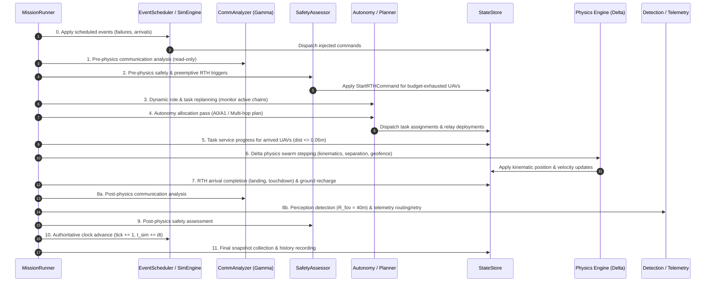
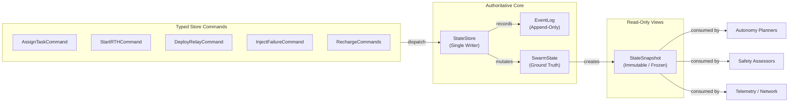

# AetherSwarm System Architecture

## 1. Executive Overview & Design Principles

AetherSwarm is engineered around a deterministic, single-writer, event-sourced architecture designed for multi-UAV disaster-response swarm coordination. Stage 1 focuses on discrete-time, CPU-only simulation where all behavioral decisions, spatial safety assessments, communication topology graphs, and energy dynamics are strictly evaluated in Python under Linux/WSL.

### Core Architectural Axioms
1. **Single-Writer State Store**: All operational state changes (positions, velocities, roles, task assignments, battery levels, and failure statuses) are mediated exclusively by a central [`StateStore`](file:///home/dell/swarm_ws/AetherSwarm/src/ares_swarm/core/state_store.py) through typed commands.
2. **Immutable Read Snapshots**: Autonomy planners, safety monitors, communication analyzers, and logging subsystems never mutate state directly. They receive an immutable [`StateSnapshot`](file:///home/dell/swarm_ws/AetherSwarm/src/ares_swarm/core/state_store.py) at each simulation tick.
3. **Strict Determinism**: Zero reliance on wall-clock time, asynchronous thread races, or unordered dictionary hashing. Given an identical scenario configuration and seed, simulation trajectories and event logs are bitwise reproducible across platforms.
4. **Decoupled Downstream Visualization**: Cyberbotics Webots R2025a acts strictly as an observational consumer and independent spatial verifier. The core simulation runs completely headless without graphical or external runtime dependencies.

---

## 2. Subsystem Decomposition

The codebase resides in `src/ares_swarm/` and is partitioned into focused functional packages:

```
src/ares_swarm/
├── core/                  # Fundamental primitives: StateStore, models, kinematics, events, simulator
├── autonomy/              # Task allocation (A0, A1) and multi-hop relay chain planning
├── communication/         # RF channel modeling, NetworkX graph management, routing algorithms
├── telemetry/             # Sensor FOV perception, detection packets, and 10s reporting evaluation
├── safety/                # Spatial separation enforcer, composite geofencing, safety assessor
├── energy/                # Battery discharge modeling, state-of-charge tracking, recharge cycles
├── evaluation/            # Mission metrics aggregation, reporting, and trace generation
└── simulation/            # Scenario loading, config management, and the central MissionRunner loop
```

### Module Responsibilities

| Subsystem | Primary Classes / Entry Points | Responsibility |
| :--- | :--- | :--- |
| **`core`** | `StateStore`, `SwarmState`, `UAVState`, `TaskState`, `KinematicsEngine`, `EventScheduler` | Maintains authoritative ground truth, enforces typed state transitions, integrates 2D motion, and schedules timed events. |
| **`autonomy`** | `A0TaskAllocator`, `A1DestinationAwareAllocator`, `ConnectivityAwarePlanner`, `RelayChain` | Evaluates task priorities, allocates surveyor and relay roles, computes geometric chain waypoints, and manages localized link handoffs. |
| **`communication`**| `CommunicationGraph`, `ChannelModel`, `DijkstraRouter`, `WeightedRouter` | Constructs dynamic topology based on physical link range ($R_{\text{comm}} = 100\,\text{m}$), tracks packet delivery rates, and solves multi-hop routing paths to GCS. |
| **`telemetry`** | `DetectionPipeline`, `TelemetryPacket`, `DetectionEvent` | Models radial sensor FOV ($R_{\text{fov}} = 40\,\text{m}$), generates detection packets, manages forwarding queues, and measures end-to-end reporting latency. |
| **`safety`** | `SeparationEnforcer`, `ChallengeAirspace`, `SafetyAssessor` | Enforces continuous $\ge 20\,\text{m}$ pairwise separation, monitors composite geofence corridors, evaluates sortie limits ($1200\,\text{s}$), and triggers preemptive RTH. |
| **`energy`** | `BatteryModel`, `EnergyTelemetry` | Models linear energy consumption during transit, hover, and communication payload processing; oversees ground battery recharge. |
| **`evaluation`**| `MissionMetricsReport`, `MetricsCollector` | Aggregates mission-wide statistics: task completion, PDR, latency compliance, handoffs, chain formations, and safety violations. |
| **`simulation`**| `MissionRunner`, `ScenarioLoader`, `AetherSwarmConfig` | Coordinates the synchronous tick loop, injects failures, reconciles subsystem proposals, and serializes execution traces. |

---

## 3. The Central Simulation Tick Loop

Simulation execution proceeds in discrete, synchronous $1.0\,\text{s}$ timesteps ($\Delta t = 1.0\,\text{s}$) managed by [`MissionRunner.step()`](file:///home/dell/swarm_ws/AetherSwarm/src/ares_swarm/simulation/runner.py). Within every tick, operations are strictly sequenced in an 11-stage causal order:



### Exact Execution Sequence in `MissionRunner.step()`

0. **Scheduled Events Application**: `sim_engine.process_scheduled_events()` evaluates the current simulation time $t_{\text{sim}}$. Injected hardware failures (`FailureStatus.FAILED`), dynamic POI arrivals, or external events are converted into commands and applied to `StateStore`.
1. **Pre-Physics Communication Analysis (Gamma)**: `comm_analyzer.analyze(current_snap)` performs read-only graph topology analysis on the current snapshot to determine GCS reachability, active connected components, and link states.
2. **Pre-Physics Safety Assessment & Preemptive RTH**:
   - `safety_assessor.assess_snapshot(current_snap, net_analysis)` evaluates current flight records.
   - `safety_assessor.evaluate_rth_triggers(...)` computes remaining sortie budget ($1200.0\,\text{s} - \tau_{\text{sortie}}$) and battery margins. For vehicles with insufficient margin to return to GCS, `StartRTHCommand` is applied immediately.
3. **Optional Safety Hook & Role Management**:
   - Executes optional `safety_hook` observer callback if configured.
   - Evaluates dynamic relay role management (`relay_manager.step(...)`), role transitions, and standby staging.
   - Connectivity planner monitors active tasks (`connectivity_planner.monitor_active_tasks(...)`), issuing replanning commands for interrupted links.
4. **Autonomy Allocation Pass (Beta)**:
   - Filters visible unassigned tasks (`TaskStatus.PENDING` or `TaskStatus.DEFERRED` where `created_time <= t_sim`).
   - Dispatches assignments via `connectivity_planner.plan(...)` (or `autonomy_adapter.plan(...)`), applying `AssignTaskCommand` and `DeployRelayCommand` atomically.
5. **Task Service Progress**:
   - For UAVs currently at assigned POI coordinates ($d \le 0.05\,\text{m}$), `ProgressTaskCommand` increments serviced duration by $\Delta t$.
   - Completed tasks clear vehicle target coordinates via `SetTargetPositionCommand`.
6. **Delta Physics Swarm Stepping**:
   - `sim_engine.step_swarm(...)` computes kinematic position updates ($v_{\max} = 5.0\,\text{m/s}$).
   - Integrates `SeparationEnforcer` (continuous analytical trajectory bisection for $\Delta r \ge 20.0\,\text{m}$) and `GeofenceEnforcer` (airspace boundary compliance).
7. **RTH Arrival Completion & Recharge Lifecycle**:
   - Returning UAVs entering staging approach ($d \le 25.0\,\text{m}$) transition to `BeginLandingCommand`.
   - Returning UAVs reaching touchdown threshold ($d \le 0.05\,\text{m}$) execute `CompleteRTHCommand` to transition to `LANDED`.
   - Landed UAVs initiate ground recharge (`StartRechargeCommand`) if multi-sortie is enabled, and complete recharge (`CompleteRechargeCommand`) after `recharge_duration_s` (default: 300.0s), restoring 100% battery and transitioning to `READY`.
8. **Post-Physics Communication, Perception & Telemetry**:
   - Generates `post_physics_snap` from store.
   - Re-analyzes RF communication graph on updated positions (`comm_analyzer.analyze(post_physics_snap)`).
   - `detection_manager.step_perception(...)`: Detects unserviced POIs within $R_{\text{fov}} \le 40.0\,\text{m}$ of active airborne UAVs ($t_{\text{detect}}$).
   - `detection_manager.step_telemetry(...)`: Routes or queues telemetry packets across the active multi-hop graph to GCS, retrying buffered packets and assessing $10.0\,\text{s}$ deadline compliance.
9. **Post-Physics Safety Assessment**:
   - Re-evaluates `safety_assessor.assess_snapshot(...)` against post-movement coordinates and updated network state.
10. **Authoritative Clock Advance**:
    - `sim_engine.advance_tick()` increments simulation tick and simulation time: $t_{\text{sim}} \leftarrow t_{\text{sim}} + \Delta t$.
11. **Snapshot & History Collection**:
    - Captures `final_snap = state_store.snapshot()`, appends `StepResult` (tick, time, net analysis, commands, events, snapshot) to `history`.

---

## 4. Single-Writer State Store & Event Sourcing

State integrity is maintained by [`StateStore`](file:///home/dell/swarm_ws/AetherSwarm/src/ares_swarm/core/state_store.py). Direct field assignment on state models is prohibited across all planning and assessment modules.



### Supported Store Commands

| Command | Target Entities | Operational Effect | Domain Event Emitted |
| :--- | :--- | :--- | :--- |
| `AssignTaskCommand` | UAV, Task | Assigns UAV to POI, transitions task to `ASSIGNED` or `IN_PROGRESS` | `TASK_ASSIGNED` |
| `ReleaseTaskCommand` | UAV, Task | Releases task back to pool (`PENDING` or `DEFERRED`), preserves serviced duration | `TASK_RELEASED`, `TASK_DEFERRED` |
| `StartRTHCommand` | UAV | Commands vehicle to return to GCS staging pad, clears active task assignment | `UAV_RTH_STARTED`, `TASK_HANDOFF` |
| `BeginLandingCommand`| UAV | Transitions vehicle from `RTH` to `LANDING` upon entering staging pad | `UAV_LANDING` |
| `CompleteRTHCommand` | UAV | Confirms touchdown at staging pad, transitions vehicle to `LANDED` | `UAV_LANDED` |
| `StartRechargeCommand`| UAV | Initiates ground power connection, sets `SortieState.RECHARGING` | `UAV_RECHARGING` |
| `CompleteRechargeCommand`| UAV | Restores 100% battery capacity, resets sortie clocks, sets `SortieState.READY` | `UAV_RECHARGED` |
| `DeployRelayCommand` | UAV, Chain | Assigns vehicle to intermediate station in active `RelayChain`, sets role `RELAY` | `RELAY_DEPLOYED` |
| `ReleaseRelayCommand`| UAV, Chain | Releases vehicle from relay duty, returns role to `IDLE` or commands RTH | `RELAY_RELEASED` |
| `InjectFailureCommand`| UAV | Marks vehicle `FailureStatus.FAILED`, aborts all active assignments | `UAV_FAILED` |

---

## 5. System Boundary: Core Simulation vs. Webots Robotics Layer

A strict boundary decouples the authoritative computational simulation from visual playback:

```
┌────────────────────────────────────────────────────────────────────────┐
│                   AETHERSWARM CORE (HEADLESS WSL / LINUX)               │
│                                                                        │
│   • Python 3.12 Single-Threaded Simulation Loop                        │
│   • 2D Kinematics Integration (v_max = 5.0 m/s)                        │
│   • Single-Writer StateStore & Event Sourcing                          │
│   • Autonomy & Multi-Hop Relay Chain Planning                          │
│   • Physical RF Channel Propagation & NetworkX Dijkstra Routing        │
│   • 20m Separation Enforcer & Composite Geofence Monitor               │
│   • Preemptive Sortie & Battery RTH Logic                              │
│   • 10s Detection-to-Reporting Latency Evaluation                      │
│   • Authoritative Mission Metrics & Official Benchmark Output          │
└───────────────────────────────────┬────────────────────────────────────┘
                                    │
                                    │ Exports Immutable Trace (.json)
                                    ▼
┌────────────────────────────────────────────────────────────────────────┐
│              WEBOTS R2025a 3D ROBOTICS LAYER (WINDOWS / LINUX)         │
│                                                                        │
│   • Cyberbotics Webots Supervisor Controller                           │
│   • High-Fidelity 3D Quadrotor Models & Ground Apron Rendering         │
│   • Metric Ground Grid (100m) & Visual Airspace Boundary Wireframes    │
│   • Interactive Playback Controls (Play/Pause, Seek, Speed Presets)   │
│   • Active RF Mesh Link Overlays & Multi-Hop Route Visualizations      │
│   • In-World HUD Telemetry Display                                     │
│   • Independent Downstream Spatial Separation & Geofence Auditing      │
│   • Zero Autonomy, Physics Overrides, or State Mutations               │
└────────────────────────────────────────────────────────────────────────┘
```

1. **Direction of Data Flow**: Data flows unidirectionally from the core simulation into Webots. Webots never feeds state back into `ares_swarm`.
2. **Trace Immutability**: Simulation traces contain full per-tick entity states (positions, headings, statuses, battery levels, active mesh edges, and POI states). Webots controllers parse traces strictly as read-only streams.
3. **Independent Spatial Auditing**: While replaying traces, the Webots supervisor runs an independent 3D Euclidean distance verifier and altitude monitor, outputting `data/webots_spatial_verification.txt`. This provides secondary verification that the core 2D simulation maintained real-world geometric constraints without trusting internal simulation assertions alone.
