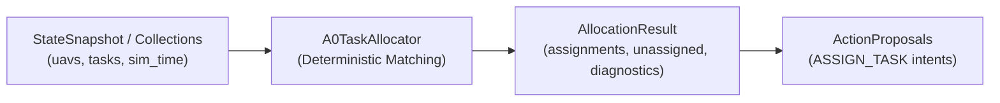
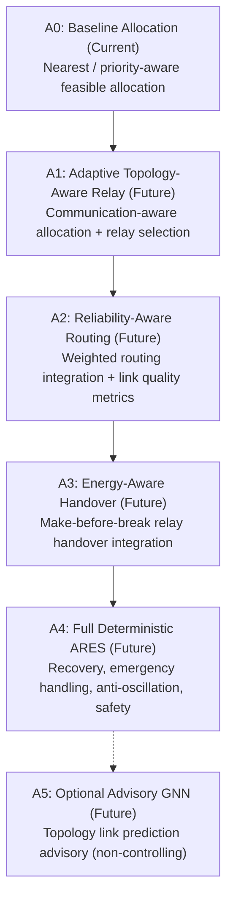

# A0 Baseline Task Allocation

## 1. Overview and Purpose

In Stage-1 of the ARES-Swarm disaster-response simulator, the swarm must coordinate autonomous multi-UAV survey and monitoring operations under strict determinism, communication constraints, and energy boundaries.

The **A0 Baseline Task Allocator** serves as the initial, non-predictive autonomy foundation. Its primary role is to establish a deterministic, priority-aware, and energy-conscious single-task allocation benchmark without relying on adaptive communication relays, predictive link-state estimation, or Graph Neural Networks (GNNs). 

Key design principles of A0:
- **Zero Direct State Mutation**: Operates strictly on read-only snapshots (`StateSnapshot`) or collections of UAV/Task views, emitting typed proposals (`TaskActionProposal` / `AllocationResult`) for validation and execution by the simulation engine and `StateStore`.
- **Absolute Determinism**: Guaranteed identical matching regardless of candidate input iteration order, dictionary hashing, or CPU architecture differences. All ties are broken via unambiguous lexicographical ordering.
- **Strict Decoupling**: Interfaces use structural subtyping (`typing.Protocol` / duck-typing) to cleanly decouple allocation logic from internal simulation storage.
- **Planned Utility Concept**: Formulates assignment scoring based on the swarm-wide utility objective, using only ground-truth terms available in Stage-1.

---

## 2. Inputs and Outputs

### Input Interfaces

The allocator accepts either an authoritative `StateSnapshot` (or `SwarmState`) or decoupled sequences of UAV and Task objects.

#### Required UAV Attributes
An eligible UAV object must expose:
- `id: str` - Unique UAV identifier.
- `position: Vector2D | tuple[float, float]` - Current 2D coordinates in meters.
- `active: bool` - Operability flag (must be `True`).
- `failure_status: str | FailureStatus` - Health status (must be `HEALTHY` or `DEGRADED`; `FAILED` or `LOST` rejected).
- `role: str | UAVRole` - Swarm role (eligible in A0: `IDLE`, `SCOUT`, `EMERGENCY_SCOUT`).
- `assigned_task_id: str | None` - Current task identifier if already assigned.
- `battery_pct: float | None` - Battery state of charge in percent `[0, 100]`.
- `energy_remaining: float | None` - Available electrical energy in watt-hours (Wh).
- `estimated_rth_energy: float | None` - Estimated energy required to return to home (Wh).
- `safety_reserve: float | None` - Reserve energy threshold (Wh).
- `cooldown_until: float`, `role_lock_until: float`, `assignment_lock_until: float` - Timestamps preventing rapid thrashing.

#### Required Task Attributes
An eligible Task object must expose:
- `id: str` - Unique task identifier.
- `position: Vector2D | tuple[float, float]` - 2D coordinates of target Point of Interest (PoI) in meters.
- `priority: float` - Task importance weighting (positive float, e.g. 1.0 to 10.0).
- `status: str | TaskStatus` - Lifecycle state (must be `PENDING` for allocation).
- `assigned_uav_id: str | None` - Current assignee (must be `None` if `PENDING`).
- `deadline: float | None` - Mission expiry timestamp in seconds.
- `is_emergency: bool` - High-urgency flag.

### Output Interface

The allocation pass produces an immutable `AllocationResult`:
- `assignments: tuple[TaskAssignment, ...]`:
  - `uav_id: str`
  - `task_id: str`
  - `score: float`
  - `score_breakdown: UtilityScore`
- `unassigned_tasks: tuple[str, ...]`: Task IDs unable to be serviced due to fleet capacity or feasibility limits.
- `unassigned_uavs: tuple[str, ...]`: UAV IDs remaining available/idle.
- `infeasible_uavs: Mapping[str, str]`: UAV IDs mapped to specific rejection explanations.
- `infeasible_tasks: Mapping[str, str]`: Task IDs mapped to rejection explanations.
- `snapshot_revision: int`: Revision number of the input snapshot.

Method `result.to_action_proposals()` converts the assignments into typed `TaskActionProposal` records (`intent="ASSIGN_TASK"`), compatible with the planned `AutonomyPlanner` interface.

---

## 3. Feasibility Rules

Before scoring candidate pairs, strict filtering ensures physical and operational safety:

| Entity | Check | Rejection Condition | Rationale |
|---|---|---|---|
| **UAV** | Active Status | `active is False` | Inactive/disabled UAVs cannot fly. |
| **UAV** | Failure Status | `failure_status in {FAILED, LOST}` | Damaged UAVs cannot execute new tasks. |
| **UAV** | RTH Status | `rth_state in {RETURNING, REQUESTED}` or `role == RETURN_TO_HOME` | UAVs returning to base cannot be diverted. |
| **UAV** | Role Lock | `role not in eligible_roles` (e.g. `RELAY`, `BACKUP_RELAY`) | In A0, dedicated relays must not be stolen for survey. |
| **UAV** | Temporal Locks | `sim_time < max(role_lock, assignment_lock, cooldown)` | Enforces anti-flapping hysteresis. |
| **UAV** | Pre-assignment | `assigned_task_id is not None` (when `allow_reassignment=False`) | Single-task commitment prevents task starvation. |
| **UAV** | Energy Reserve | `energy_remaining <= estimated_rth + safety_reserve` | Prevents battery exhaustion before safe RTH. |
| **UAV** | Battery Cutoff | `battery_pct <= min_battery_pct` (default 15.0%) | Hard safety floor when explicit Wh energy is uncalibrated. |
| **Task** | Status | `status != PENDING` (`COMPLETED`, `FAILED`, `CANCELLED`, `ASSIGNED`, `IN_PROGRESS`) | Only unassigned, pending tasks can be scheduled. |
| **Task** | Deadline | `deadline is not None and sim_time >= deadline` | Expired tasks cannot be assigned. |

---

## 4. Utility Scoring Logic

The planned multi-factor utility function for candidate UAV $i$ and Task $j$ is:

$$\text{Utility}(i, j) = w_P \cdot P_j - w_T \cdot C_{\text{travel}}(i, j) - w_E \cdot R_{\text{energy}}(i) + w_C \cdot \Gamma_{\text{conn}}(i, j) - w_N \cdot R_{\text{net}}(i, j) - w_S \cdot C_{\text{switch}}(i, j)$$

### Term Definitions in A0:

1. **Task Priority ($w_P \cdot P_j$)**:
   - $P_j = \text{task.priority}$ (default 1.0).
   - Higher priority tasks produce greater utility.
2. **Travel Cost ($w_T \cdot C_{\text{travel}}(i, j)$)**:
   - $C_{\text{travel}}(i, j) = \| \mathbf{p}_i - \mathbf{p}_j \|_2 = \sqrt{(x_i - x_j)^2 + (y_i - y_j)^2}$.
   - Measures Euclidean distance in meters. Default $w_T = 0.001$.
3. **Energy Depletion Risk ($w_E \cdot R_{\text{energy}}(i)$)**:
   - Evaluated only when authoritative battery or energy telemetry exists.
   - If `battery_pct` available: $R_{\text{energy}} = \frac{100 - \text{battery\_pct}}{100} \in [0.0, 1.0]$.
   - If only `energy_remaining` and capacity available: $R_{\text{energy}} = \frac{E_{\text{cap}} - E_{\text{rem}}}{E_{\text{cap}}} \in [0.0, 1.0]$.
   - If energy data is unpopulated: $R_{\text{energy}} = 0.0$ (no fabricated numbers). Default $w_E = 0.1$.
4. **Connectivity Contribution ($w_C \cdot \Gamma_{\text{conn}}(i, j)$)**:
   - Set to $0.0$ ($w_C = 0.0$) for A0 baseline because adaptive mesh relaying is introduced in A1.
5. **Network Risk ($w_N \cdot R_{\text{net}}(i, j)$)**:
   - Set to $0.0$ ($w_N = 0.0$) for A0 baseline because predictive GNN link forecasting is introduced in A3.
6. **Task Switching Penalty ($w_S \cdot C_{\text{switch}}(i, j)$)**:
   - $C_{\text{switch}} = 1.0$ if UAV $i$ is currently assigned to a different task, otherwise $0.0$. Default $w_S = 1.0$.

---

## 5. Deterministic Tie-Breaking & Matching

To guarantee deterministic, reproducible simulations:

1. **Task Pre-sorting**:
   - Primary: Priority descending (`-priority`)
   - Secondary: Emergency flag descending (`is_emergency=True` before `False`)
   - Tertiary: Task ID ascending (`task.id` lexicographical string sort)
2. **Candidate Evaluation & UAV Selection**:
   - For each task in priority order, utility scores are computed for all currently available feasible UAVs.
   - Candidate scores are rounded to 8 decimal places to eliminate cross-platform floating-point epsilon jitter.
   - Candidates are ranked by:
     1. Rounded utility score descending (`-round(score, 8)`)
     2. UAV ID ascending (`uav.id` lexicographical string sort)
   - The top candidate is assigned, and immediately removed from the unassigned candidate pool.

---

## 6. Algorithmic Complexity

- **Task Feasibility & Sorting**: For $M$ tasks, feasibility checking is $O(M)$ and sorting is $O(M \log M)$.
- **UAV Feasibility**: For $N$ UAVs, feasibility checking is $O(N)$.
- **Greedy Matching**: In each pass, a task scores at most $N$ UAVs. Total scoring operations are at most $\sum_{k=0}^{\min(M, N)-1} (N - k) = O(M \cdot N)$.
- **Candidate Sorting**: At each assignment, sorting $\le N$ candidates takes $O(N \log N)$.
- **Total Time Complexity**: $O(M \log M + M \cdot N \log N)$.
- **Space Complexity**: $O(M + N)$ to store candidate mappings and assignments.

Given typical swarm scales in Stage-1 ($N \le 30$ UAVs, $M \le 100$ tasks), this polynomial complexity is computationally suitable for single-threaded CPU Stage-1 simulation.

---

## 7. Limitations of A0 & Reassignment Contract

1. **Pending-Only Allocation**: The current A0 baseline strictly allocates `PENDING` tasks to idle/available UAVs. It does not perform dynamic in-flight preemption or task cancellation.
2. **Reassignment Behavior**: The configuration option `allow_reassignment` defaults to `False`, excluding any UAV that already has an active assignment (`assigned_task_id is not None`). While the flag and switching cost term ($w_S$) are preserved for future interface compatibility, dynamic task reassignment and preemption will be introduced by later recovery and emergency logic (A4). A0 avoids inventing incomplete or uncoordinated preemption mechanisms.
3. **Single-Task Assignment**: Each UAV handles at most one active task at a time (ST-SR: Single Task, Single Robot); multi-task tour planning is deferred.
4. **Greedy Matching**: Priority-first greedy matching is locally optimal per priority tier but does not solve global min-cost maximum-matching (Hungarian or auction algorithms deferred to A4).
5. **No Communication Awareness**: A0 does not evaluate whether moving to a task degrades or severs multi-hop GCS connectivity.
6. **Static Energy Projection**: Travel energy feasibility is checked via remaining reserve thresholds rather than dynamic aerodynamic trajectory integration.

---

## 8. Planned Extension Path Toward A1–A5

The architecture of `task_allocator.py` establishes the baseline interfaces while anticipating upcoming milestones. **A0 is the only currently implemented allocation level**; levels A1 through A5 represent future extension phases:

### Planned Extension Milestones (Future Work):

- **A0 (Current Baseline)**: Deterministic priority-first matching based on task priority, Euclidean travel cost, basic battery thresholds, and deterministic tie-breaking.
- **A1 (Future Extension - Adaptive Relay & Topology Awareness)**: Incorporates `CommunicationAnalyzer` outputs to populate $w_C \cdot \Gamma_{\text{conn}}$, rewarding UAVs that preserve or establish multi-hop mesh connectivity.
- **A2 (Future Extension - Reliability-Aware Routing)**: Integrates communication link quality metrics, packet delivery rates, and weighted routing into the allocation decision pipeline.
- **A3 (Future Extension - Energy-Aware Handover)**: Introduces energy-conscious make-before-break relay handover coordination, balancing transmission power against battery longevity.
- **A4 (Future Extension - Full Deterministic ARES Swarm Behavior)**: Unifies fault recovery, emergency task preemption, anti-flapping/hysteresis controls, geofencing, and separation safety constraints into a deterministic state-machine workflow.
- **A5 (Future Extension - Optional Advisory GNN Prediction)**: Evaluates Graph Neural Network models to generate advisory link survival probabilities and predictive risk scores ($w_N \cdot R_{\text{net}}$). **GNN models will serve strictly in an advisory capacity** and will never directly command UAV actuators or bypass deterministic safety rules.

---

## 9. Authoritative Shared Core Contracts

A0 integrates into the end-to-end simulation pipeline using the authoritative types from `ares_swarm`:

1. `ares_swarm.core.models`:
   - `Vector2D(x: float, y: float)`
   - `UAVState(id: str, position: Vector2D, active: bool, failure_status: FailureStatus, ...)`
   - `TaskState(id: str, position: Vector2D, priority: float, status: TaskStatus, ...)`
   - `SwarmState(gcs: GCSState, uavs: tuple[UAVState, ...], tasks: tuple[TaskState, ...], ...)`
2. `ares_swarm.core.state_store`:
   - `StateSnapshot(state: SwarmState, revision: int)`
3. `ares_swarm.autonomy`:
   - `TaskActionProposal(intent: str, target_id: str, uav_id: str, parameters: dict)`
   - `A0TaskAllocator`: `allocate(snapshot: StateSnapshot) -> AllocationResult`
